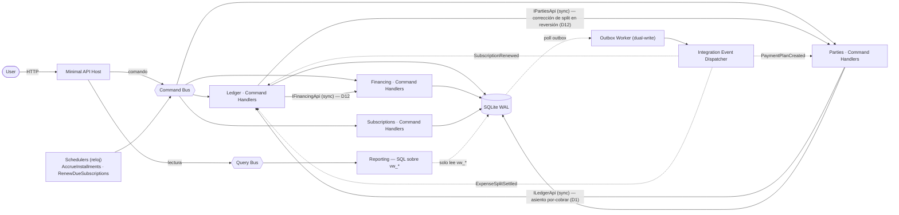

# Diseño Técnico Definitivo — Aplicación Personal de Finanzas

**Monolito Modular · CQRS · Event-Driven (Outbox) · SQLite · .NET 10**

> Documento único de referencia: requisitos, diseño de arquitectura y estructura de carpetas completa.

---

## 0. Decisiones de diseño

| # | Decisión |
|---|---|
| D1 | El Ledger es la única fuente de verdad contable. Incluye los "por cobrar" del titular como una cuenta de activo. `Parties` es la vista de gestión sobre esas cuentas, no un segundo libro mayor. |
| D2 | RF-4 separado en Devengo (`AccrueInstallments`) y Pago del resumen (`PayStatement`) |
| D3 | RF-6 vía asiento inverso (storno), Ledger append-only |
| D4 | RF-7: running balance expuesto como vista de línea de tiempo reconstruida en lectura (SQLite no tiene vistas materializadas) |
| D5 | El read side lee exclusivamente vistas `vw_*`, nunca tablas base de otro módulo |
| D6 | El Outbox se usa solo para dual-write disparado por transacción. El trabajo disparado por reloj (devengo, renovación) va a un **scheduler separado**, no al Outbox |
| D7 | SQLite en `WAL` + `busy_timeout` |
| D8 | RF-3 se resuelve con orquestación **eventual** entre Financing y Parties |
| D9 | RF-1 (débito **y efectivo**) usa el mismo criterio que D1: muestra la parte propia del titular |
| D10 | ~~RF-6 rechaza la reversión de un asiento que ya tiene pagos aplicados~~ — **superseded por D12** (PRD actualizado) |
| D11 | Frontera de autoridad de la deuda de tarjeta (Modelo B): el Ledger es autoritativo sobre el pasivo **devengado**; Financing sobre el **calendario futuro**. El devengo transfiere la propiedad de la cuota entre ambos. |
| D12 | RF-6 revisado: la reversión siempre se aplica, incluso con pagos aplicados, mediante asiento compensatorio + cascada a Financing y Parties |
| D13 | La API se diseña compatible con un futuro cliente Angular (CORS, envelope de error consistente, OpenAPI) sin comprometer la testeabilidad |

---

## 1. Principios de arquitectura

- **Monolito Modular**: un solo proceso, un solo `.sln`, cuatro bounded contexts aislados por ensamblado (`.Contracts` público + implementación `internal`).
- **CQRS**: Command Bus y Query Bus separados desde el Host. El write side vive en los módulos; el read side es un proyecto aparte (`Reporting`) que no escribe nada.
- **Event-Driven con Outbox**: los eventos de integración disparados por una transacción se escriben en la misma transacción que el cambio de dominio y se despachan después vía el Outbox Worker. El trabajo disparado por reloj (devengo, renovación) usa un scheduler, que es un mecanismo distinto — ver D6.
- **SQLite**: un solo archivo, un solo escritor real. `WAL` da lectores concurrentes, no escritores concurrentes.

> Este diseño es deliberadamente más pesado de lo que un gestor de gastos personal exige. El objetivo declarado es practicar diseño de API y una arquitectura modular con CQRS y mensajería sobre un dominio real, no minimizar el tiempo hasta el primer gasto registrado. Las decisiones se juzgan bajo ese objetivo: se conservan los patrones aunque el dominio no los requiera, y solo se corrige lo que estaría mal *dentro* del propio patrón — sobre todo la corrección contable del Ledger.

---

## 2. Decisiones de diseño

### D1 — El Ledger es la única fuente de verdad contable

El Ledger asienta el patrimonio del titular por partida doble, y un patrimonio incluye los derechos de cobro. Cuando el titular adelanta dinero de un gasto compartido, la parte de los terceros **es un activo del titular** (una cuenta por cobrar) y se asienta como tal en el Ledger. No se saca del Ledger: sacarla dejaba el efectivo sin reconciliar contra el banco real.

Ejemplo — gasto de $1.000 compartido 50/50, pagado desde el banco:
```
Dr  Gasto:Categoría            500
Dr  Activo:PorCobrar (tercero) 500
    Cr  Activo:Banco               1.000
```
El banco baja $1.000 (real), el gasto propio es $500, y el derecho de cobro de $500 queda registrado como activo. El patrimonio neto no cambia por la parte prestada (un activo se convirtió en otro), que es contablemente correcto.

`Parties` deja de ser un segundo libro mayor: pasa a ser la **vista de gestión** sobre las cuentas por cobrar del Ledger — con quién, running balance por persona, línea de tiempo. El `ExpenseSplit` y el `PhantomPennyAllocator` siguen siendo suyos, pero el saldo adeudado es un reflejo de las cuentas del Ledger, no un dato paralelo.

### D2 — Devengo y pago son operaciones distintas

- **`AccrueInstallmentsCommand`** — disparado por el **scheduler** (ver D6) al cerrar el ciclo de la tarjeta. Devenga el pasivo:
  ```
  Dr  Gasto:Categoría            1.000
      Cr  Pasivo:Tarjeta Visa        1.000
      (SplitReference -> ExpenseSplit #… si aplica)
  ```
- **`PayStatementCommand`** — endpoint explícito. Cancela el pasivo devengado contra el banco:
  ```
  Dr  Pasivo:Tarjeta Visa        3.000
      Cr  Activo:Banco               3.000
  ```
  El monto cobrado es **Σ de las cuotas devengadas, no revertidas y todavía impagas** del resumen — **no** el `MonthlyStatement.AmountDue` almacenado. `AmountDue` sólo se incrementa (nunca se descuenta), así que sigue incluyendo cuotas revertidas; pero revertir una cuota devengada ya bajó el `Pasivo:Tarjeta` del Ledger (storno, D3/D12). Cobrar el `AmountDue` almacenado sobre un resumen con una cuota revertida sobredebitaría el pasivo y sobregiraría del banco: sumar las cuotas vivas coincide con lo que el pasivo del Ledger ya refleja (mismo criterio que `GetCreditorPayables`, que filtra `IsReversed == false`). Es idéntico para resúmenes sin reversiones. Al pagar, cada cuota liquidada queda sellada con su propio `Installment.PaidOnUtc` y el resumen con el suyo; el pago de cuotas individuales es materia de `PayInstallmentCommand` (abajo). El saldo a favor arrastrado por reversión (D12) se netea contra ese monto, no contra el `AmountDue`.
- **`PayInstallmentCommand`** — endpoint explícito `POST /v1/financing/installments/{id}/pay`. Cancela **una** cuota devengada del resumen contra el banco, sin netear el saldo a favor de la tarjeta (eso queda sólo en `PayStatementCommand`):
  ```
  Dr  Pasivo:Tarjeta Visa        1.000
      Cr  Activo:Banco               1.000
  ```
  Sólo cuotas de tarjeta devengadas, no revertidas e impagas (si no → 409 `InstallmentAlreadyReversed` / `InstallmentAlreadyPaid` / `InstallmentNotAccrued`); id desconocido → 404. La transacción **no** lleva `InstallmentReference` (igual que `PayStatement` y el devengo por vencimiento de la parte del co-deudor — así el mapeo devengo→reversión no se vuelve ambiguo). Sella `Installment.PaidOnUtc`; si con eso quedan pagas todas las cuotas devengadas y no revertidas del resumen, sella también el `MonthlyStatement.PaidOnUtc`. Pagar una cuota y pagar el resumen entero conviven; como `PayStatement` ya cobra sólo Σ de las cuotas impagas (Slice 1), no hay ventana de doble pago. Detalle en `docs/individual-installment-payments/slice-2-pay-single-installment.md`.
- **`GetMonthlyStatementQuery`** — read model, sin efectos. `GET /v1/financing/statements/{id}` lista, antes de pagar, las cuotas ya devengadas que componen el `AmountDue` del resumen (RF-4 AC1): por cuota, plan / secuencia N de M / fecha de compra / ciclo / monto / si fue revertida / si está paga y su `PaidOnUtc`. Como `Installment.StatementId` sólo se asigna en el devengo, la respuesta es exactamente el pasivo contable ya reconocido (D11) — las cuotas futuras siguen en `GET /v1/financing/cards/{id}/future-schedule`.
- **`ListRecentPurchasesQuery`** — read model, sin efectos. `GET /v1/financing/purchases/recent` agrega a cada compra dos valores **derivados** de sus cuotas: `paidInstallmentCount` (cuántas tienen `PaidOnUtc`) y el **mes de pago de la próxima cuota** — la cuota impaga, no revertida, más temprana por secuencia, proyectada por `BillingCycle.DueCycle` (nulo cuando no queda ninguna). No reprograma nada; sólo expone lo que ya existe, para que "Compras recientes" muestre "N/M pagadas · próximo: `<mes>`". Detalle en `docs/individual-installment-payments/slice-3-next-payment-visibility.md`.
- **`CreatePaymentPlanCommand` retroactivo (compra de tarjeta con fecha pasada)** — cuando el plan es de **tarjeta** y su `PurchaseDate` es anterior a hoy, `CreatePaymentPlanHandler` corre el devengo y el pago de las cuotas ya vencidas **en el mismo momento de crear el plan**, no en un tick del scheduler, para que "Compras recientes" y la lista de resúmenes queden correctas al instante. Por cada cuota cuyo ciclo de cierre ya cerró (`BillingCycle.IsClosedAsOf(hoy, corte)`, en orden ascendente hasta el primer ciclo no cerrado): **(1) devenga** igual que la Compuerta 1 de `AccrueInstallments` — `Dr Gasto:Tarjeta / Cr Pasivo:Tarjeta`, pero **fechado en la fecha de corte histórica** de ese ciclo, más `statement.Accrue` sobre el `MonthlyStatement` (nuevo o existente) y `Installment.MarkAccrued`; **(2) paga**, sólo si el mes de pago de la cuota es estrictamente anterior al mes en curso — `Dr Pasivo:Tarjeta / Cr Activo:Banco` fechado en la fecha de vencimiento histórica, `Installment.MarkPaid`, y `MonthlyStatement.MarkPaid` si con eso quedan pagas todas sus cuotas. El banco que fondea esos pagos viene en el nuevo `BankAccountId` del comando (la ruta de pago no tiene banco por defecto); es **obligatorio** sólo cuando la compra de tarjeta es retroactiva y tiene al menos una cuota vencida. Se rechaza `PurchaseDate > hoy` en todos los modos (`FuturePurchaseDate`, 422). Los asientos al Ledger son cross-módulo sin saga (mismo contrato que el scheduler y `PayInstallmentCommand`). La cuota del mes en curso se devenga pero **no** se paga (queda "pendiente este mes"). Como las cuotas pre-liquidadas quedan con `AccruedOnUtc` / `PaidOnUtc`, la Compuerta 1 del scheduler las saltea; `SplitAccruedOnUtc` se deja en nulo, así la Compuerta 2 sigue devengando la parte del co-deudor por vencimiento sin cambios. Detalle en `docs/backdated-expenses/slice-1-card-backdating.md`. **Modo acreedor (Slice 2):** `PaymentPlan.Create` resuelve el primer ciclo del plan de acreedor con `BillingCycleCalculator.ResolveCycle(purchaseDate, 26)` (constante `PaymentPlan.CreditorCutoffDay`), igual que las tarjetas — una compra posterior al 26 rueda al ciclo siguiente, de forma **uniforme** (no sólo las retroactivas). Y al crear un plan de acreedor con `purchaseDate` pasada, `CreatePaymentPlanHandler` marca `Installment.MarkPaid` en cada cuota cuyo mes de pago ya pasó — **sólo el sello `PaidOnUtc`, sin asiento al Ledger, sin devengo, sin `MonthlyStatement`, sin banco** (la deuda con un acreedor no tiene huella contable para el titular en ninguna parte; no existe comando "pagar al acreedor"). No se toca `SplitAccruedOnUtc`, así la Compuerta 3 (`accrueDueCreditorSplitReceivablesAsync`) sigue devengando la parte del co-deudor por vencimiento sin cambios. Un libro mayor completo de acreedores es una iniciativa aparte. Detalle en `docs/backdated-expenses/slice-2-creditor-cutoff.md`.

### D3 — Reversión vía asiento inverso

El Ledger es append-only: no se edita ni se borra ningún asiento. Una reversión genera una `Transaction` nueva con débitos y créditos espejados, con `OriginalTransactionId` apuntando al asiento original. Una reversión no puede revertirse — evita loops.

### D4 — Cuentas corrientes con "gravedad contable"

Una `CurrentAccount` por persona, cuyo saldo es un reflejo de las cuentas por cobrar del Ledger (D1). Las deudas cruzadas se netean solas porque son signos opuestos sobre el mismo saldo. El endpoint de liquidación (`POST /parties/{id}/settle`) aparece cuando hay transferencia real de dinero, y asienta la **cancelación del activo por cobrar** — no un ingreso, porque cobrar lo que te deben no aumenta el patrimonio:
```
Dr  Activo:Banco               6.000
    Cr  Activo:PorCobrar (tercero)   6.000
```
El running balance se expone como una vista de línea de tiempo que reconstruye los movimientos ordenados **en tiempo de lectura**. SQLite no tiene vistas materializadas; no se promete persistencia del saldo agregado, se recalcula al consultar.

### D5 — El read side lee vistas, no tablas base

`Reporting` no conoce el esquema interno de ningún módulo: cada módulo publica vistas `vw_*` como parte de su superficie pública estable. Si un módulo refactoriza sus tablas internas, mantiene la vista y `Reporting` no se entera.

### D6 — Outbox y scheduler son mecanismos distintos

El patrón Outbox resuelve el **dual-write disparado por una transacción**: persistir un cambio de dominio y publicar un evento de forma atómica. En este sistema, el único caso genuino es el split de RF-3 (D8): una transacción crea el plan y debe emitir un evento sin riesgo de perderlo.

El **devengo de cuotas** (D2) y la **renovación de suscripciones** (RF-5) no se disparan por una transacción, se disparan por un **reloj** (cierre de ciclo, fecha de renovación). Eso es un scheduler, no un Outbox. Confundirlos lleva a usar Outbox donde corresponde un cron. Se modelan como `BackgroundService` separados (`AccrueInstallments`, `RenewDueSubscriptions`) que emiten comandos; el Outbox Worker es otro `BackgroundService`, dedicado solo a drenar las tablas `*_outbox_messages`.

### D7 — SQLite en WAL + busy_timeout

La API, el Outbox Worker y los schedulers escriben en el mismo archivo. Sin esto, el primer `SQLITE_BUSY` bajo concurrencia mínima es cuestión de tiempo, no de probabilidad.

### D8 — RF-3 se resuelve con orquestación eventual

`Financing.CreatePaymentPlanCommand` crea siempre el plan de pago. Si el comando incluye división entre terceros, `Financing` publica `PaymentPlanCreatedIntegrationEvent` con el detalle bruto del reparto en su propio Outbox, dentro de la misma transacción que crea el plan (este sí es un dual-write legítimo, D6).

El Outbox Worker despacha el evento; `Parties` lo consume en `OnPaymentPlanCreated`, aplica el `PhantomPennyAllocator`, crea el `ExpenseSplit` y solicita al Ledger el asiento de las cuentas por cobrar (D1), deduplicando contra su inbox. El plan de pago existe de inmediato; el split y sus por-cobrar se reflejan con el delay del Worker.

**Consecuencia aceptada:** hay una ventana en la que el plan existe sin que el split se haya registrado. Ver RNF-7 para el mecanismo de detección.

### D9 — RF-1 usa el mismo criterio que D1

El resumen mensual de gastos débito **y efectivo** muestra la parte propia del titular — el gasto real incurrido — no el total desembolsado cuando una parte es un préstamo a terceros (que es un activo, no un gasto). Débito y efectivo se agrupan bajo el mismo `AccountKind` de "ya gastado, sin ciclo de facturación futuro" (ver D12/§6, `AccountKind.cs`) — a diferencia del crédito, que sí es un compromiso futuro (D11).

El gasto de tarjeta se aísla de ese resumen por un `AccountKind` propio, no por convención de nombres: cada tarjeta provisiona su cuenta de compras como `AccountKind.CardPurchases` (distinta de `Expense`, que queda para el gasto propio directo — débito, efectivo, suscripciones). `vw_ledger_monthly_expenses` filtra `Type = 'Expense' AND Kind NOT IN ('Receivable', 'CardPurchases')`, así que ni la parte del tercero ni el devengo de una cuota de tarjeta entran en el total de "débito y efectivo" que US-1 AC2 pide separar del crédito.

### D10 — La reversión se rechaza si hay pagos aplicados *(superseded — ver D12)*

> **Nota de revisión:** este texto se conserva sin editar por trazabilidad histórica (igual que un asiento revertido en el propio Ledger no se borra). El PRD actualizado (US-6) requiere que la reversión funcione incluso con pagos aplicados. El comportamiento vigente es el de **D12**, no el descrito acá.

`ReverseTransactionHandler` rechaza la operación si la transacción a revertir es un devengo y el installment asociado ya tiene un pago aplicado. La verificación se hace vía llamada síncrona a `IFinancingApi`, consultando el estado del installment referenciado.

**Consecuencia aceptada (histórica, ya no vigente):** el sistema no ofrece una operación para "deshacer un pago". Un asiento devengado y ya pagado queda inmutable; cualquier corrección en ese escenario requiere intervención manual.

### D11 — Frontera de autoridad de la deuda de tarjeta (Modelo B)

La deuda de tarjeta no vive duplicada: cada representación tiene un dominio temporal que no se solapa.

- **Pasivo devengado (cuotas ya incurridas e impagas)** → autoridad del **Ledger**. Es el saldo de `Pasivo:Tarjeta`. Responde "¿cuánto debo *ahora*?".
- **Calendario futuro (cuotas aún no devengadas)** → autoridad de **Financing**. Es la suma de installments pendientes. Responde "¿cuánto me falta *en total*?".

El **evento de devengo** (D2) es el instante en que una cuota deja de ser un compromiso futuro de Financing y se convierte en pasivo contable del Ledger. Antes de devengarse, una cuota no es un pasivo: es una promesa.

**Consecuencia aceptada:** al comprar algo en 3 cuotas, el Ledger no muestra un pasivo de inmediato — muestra $0 hasta que cierra el primer ciclo, y el pasivo crece cuota a cuota. El patrimonio neto según el Ledger baja mes a mes, no de golpe al comprar. La pregunta "¿cuánto debo en total, contando lo no devengado?" se responde en `Reporting` cruzando la vista de pasivo del Ledger con la de calendario de Financing — no en ningún módulo por separado.

**Mes de pago vs. mes de cierre (PRD decisiones 9–10).** Lo almacenado en la cuota es el **ciclo de cierre** (identidad del `MonthlyStatement`, sin migración). Las superficies **de pago** — el bloque "Programado" del tercero (`GetFuturePartyShares`), el calendario futuro de la tarjeta (`GetCardFutureSchedule` / `vw_card_future_schedule`) y el "deuda por ciclo" del panel — proyectan `DueCycle = Cycle.AddMonths(1)` en la lectura; las superficies **de resumen** siguen mostrando el ciclo de cierre. En un gasto compartido, la cuenta por cobrar del co-deudor se **devenga al llegar `DueCycle`**, no al cerrar el ciclo, en un segundo gate de `AccrueInstallments` marcado con `Installment.SplitAccruedOnUtc`. El modo **financiado por un acreedor** se unifica bajo la misma regla: `PaymentPlan.Create` guarda el **mes de la compra** como ciclo, de modo que la proyección `+1` da la primera cuota el mes siguiente sin ramas tarjeta-vs-acreedor; su parte de co-deudor arranca en $0 y se devenga por vencimiento en el **mismo** scheduler (un tercer gate que asienta `Dr PorCobrar_k / Cr CreditorPayable`, mismo marcador `SplitAccruedOnUtc`), en vez del asiento por adelantado y el scheduler paralelo que había antes. `BillingCycleCalculator.ResolveCycle` y el devengo del titular no cambian. La **lista** de terceros consume además una versión agregada de esa proyección — `GetPendingSharesByParty` (Financing, misma población y reparto que `GetFuturePartyShares`, sumada por tercero; `GET /v1/parties/pending-shares`) — para distinguir un tercero saldado de uno con $0 asentado pero cuotas por venir; no toca el devengo ni el libro (PRD decisión 11).

**Identidad de tarjeta compartida entre las dos vistas.** El pasivo devengado lo publica el Ledger (`vw_card_liability_accrued`) y el calendario futuro lo publica Financing (`vw_card_future_schedule`); para que `Reporting` pueda cruzarlas por tarjeta y no solo etiquetar dos buckets, la cuenta `Pasivo:Tarjeta` del Ledger lleva el `CardId` de Financing como referencia opaca (`OwnerReferenceId` en `CreateAccountCommand` / `Account`, un `Guid?` sin tipo cruzado — mismo patrón que `SubscriptionReferenceId` en `PostTransactionCommand`). `vw_card_liability_accrued` lo expone en minúsculas (`lower(...)`) como `CardId`, y `card_due_by_month.sql` lo arrastra en ambas mitades del `UNION`, de modo que los buckets `Accrued` y `Future` comparten una clave por tarjeta estable ante mayúsculas/minúsculas. Para la **etiqueta visible**, la mitad `Future` usa el nombre real de la tarjeta (`vw_card_future_schedule` hace `JOIN` a `financing_credit_cards` para exponer `CardName`, y `card_due_by_month.sql` selecciona `CardName AS Card` en vez del GUID crudo), de forma que ambos buckets muestran un nombre y no solo la mitad `Accrued`.

### D12 — Reversión completa con asiento compensatorio (supersede D10)

El PRD (US-6) exige que revertir un gasto funcione incluso sobre cuotas ya devengadas y pagadas, y que la deuda de un tercero se corrija automáticamente si el gasto revertido estaba repartido. `ReverseTransactionHandler` deja de rechazar la operación; en cambio:

1. **Siempre** postea el asiento storno espejado contra el asiento original (D3 no cambia — sigue sin poder revertirse una reversión).
2. Si `IFinancingApi` informa que el installment ya fue pagado vía un resumen (`MonthlyStatement`), postea **además** un asiento compensatorio:
   ```
   Dr  Activo:CréditoTarjeta (Visa)   1.000
       Cr  Pasivo:Tarjeta (Visa)          1.000
   ```
   El storno del paso 1 se postea **siempre**, así que ya espejó el devengo original (`Dr Pasivo:Tarjeta / Cr Gasto:Categoría`): el gasto quedó revertido y el pasivo devengado, bajado. Volver a acreditar `Gasto:Categoría` acá lo contaría dos veces; el compensatorio, en cambio, reconstruye el pasivo y estaciona el saldo a favor en un activo de tarjeta (`Activo:CréditoTarjeta`) listo para netear. Tampoco se acredita `Activo:Banco` directamente — hacerlo violaría RNF-5 (el banco solo refleja desembolsos reales; acá no hubo un ingreso real de dinero, el banco no devuelve nada todavía).
3. Ese crédito de tarjeta se **descuenta automáticamente** del próximo `PayStatementCommand` de esa tarjeta — no es un ajuste manual. Esto es necesario para cumplir US-2 AC2 (el monto a pagar debe coincidir con lo que el banco real factura, y un resumen real neta un crédito previo contra el mes siguiente). `CreditCard`/`MonthlyStatement` necesitan un campo de saldo a favor arrastrado (ver §6).
4. Si el asiento original tenía un `SplitReference`, Ledger llama sincrónicamente a `IPartiesApi` (nuevo arco, ver §5.3) para corregir la cuenta corriente del tercero afectado, en la misma operación — simétrico al arco síncrono Parties→Ledger de D1 y al arco síncrono Ledger→Financing que ya existía en D10. Esta corrección es **solo de metadatos**: el storno del paso 1 ya espejó las patas `Cr Activo:PorCobrar`, con lo que el saldo del tercero ya quedó corregido en el Ledger; `CorrectExpenseSplitHandler` únicamente avanza `ExpenseSplit.ReversedReceivable` y no postea ningún asiento (RNF-5). Si la llamada falla, se registra una advertencia y la reversión igual se completa (sin saga).
5. Financing marca el installment como revertido (vía una mutación nueva en `IFinancingApi`) para que deje de aparecer en `vw_card_future_schedule` y en el pasivo devengado, sin importar si ya había sido devengado o pagado.

**Consecuencia aceptada (más acotada que la de D10):** esto no devuelve efectivo real de inmediato — genera un crédito a favor contra los próximos resúmenes de esa tarjeta. Si hiciera falta un reintegro real e inmediato (por ejemplo, la tarjeta se está dando de baja y no habrá un "próximo resumen" contra el cual netear), esa situación sigue requiriendo intervención manual.

### D13 — La API se diseña compatible con un futuro cliente Angular

Por ahora la API es de consumo puro (Swagger/Postman), sin autenticación más allá de proteger el acceso a la aplicación en sí (PRD §4). Hay un cliente Angular planeado, así que el host se diseña compatible con ese consumo sin comprometer la testeabilidad de los endpoints:

- **CORS** habilitado para el origen del cliente Angular (configurable, no hardcodeado).
- **Envelope de error consistente** en todas las respuestas 4xx/5xx, derivado de `SharedKernel.Error` (`Code`, `Message`, `Metadata`) — un único middleware/filter en el Host, no lógica duplicada por endpoint.
- **OpenAPI** completo (ya presente en el scaffold vía `Microsoft.AspNetCore.OpenApi`) con detalle suficiente para que un futuro generador de cliente TypeScript lo consuma.

**Implementación (Fase 8).** El envelope es un `ProblemDetails` RFC-9457 enriquecido (no un body propio): `Error.Code` → `extensions["code"]`, `Error.Message` → `detail`, `Error.Metadata` fusionado en extensions (`code`/`status` quedan en la raíz del body, no anidados). El status HTTP se deriva del código con una función pura — `src/Bootstrap/PersonalFinance.Api/Endpoints/ErrorHttpStatusHelper.cs`, **fuente de verdad** del mapeo: sufijo `NotFound` → 404; conflicto de estado (`AlreadyPaid`/`AlreadyAccrued`/`AlreadyReversed`/`NotActive`/`CannotReverseAReversal`/`SettlementExceedsBalance`) → 409; validación de dominio (`Invalid*`/`NonPositive*` y el set catalogado) → 422; resto → 400. `ProblemResultsHelper.From(Error)` lo construye; `GlobalExceptionHandler` cubre lo no controlado (`FormatException`/`ArgumentException` de la capa de mapeo → 400 `Request.Malformed`; resto → 500 `Server.Unhandled`, detalle genérico fuera de Development). Todo `POST` que crea un recurso responde `201` sin header `Location`. CORS: sección `Cors:AllowedOrigins` de `appsettings` → política `"client"`. OpenAPI servido siempre en `/openapi/v1.json` (la UI Scalar queda sólo en Development). `/health` expone `OutboxHealthCheck` vía `MapHealthChecks` (Healthy/Degraded → 200, Unhealthy → 503).

**Registro de instrumentos de pago como una sola acción.** El PRD (§6, prerrequisito transversal) modela el alta de un banco/tarjeta como una única acción del usuario, donde se elige el tipo (débito, crédito, efectivo). Técnicamente, débito/efectivo son `Account` (Ledger) y crédito es `CreditCard` (Financing) — dos agregados en dos módulos distintos. Para no romper el aislamiento de módulos ni inventar un agregado compartido, la solución es un endpoint único a nivel Bootstrap — `POST /instruments` — que no tiene lógica de dominio propia: solo enruta al comando correcto (`CreateAccountCommand` vía `ILedgerApi`, o `CreateCreditCardCommand` vía `IFinancingApi`) según el `type` recibido. El Bootstrap host ya depende de los `.Contracts` de todos los módulos para exponer sus endpoints, así que este enrutamiento no agrega una dependencia nueva entre módulos.

---

## 3. Requisitos funcionales

| # | Caso de uso | Tipo | Módulo(s) | Estado |
|---|---|---|---|---|
| RF-1 | Resumen de gastos del mes (débito y efectivo) | Query | Reporting | Cubierto (D9; tarjeta aislada por `AccountKind.CardPurchases`) |
| RF-2 | Cuánto pagar por mes agrupado por tarjeta | Query | Reporting (D11) | Cubierto (clave por tarjeta compartida vía `OwnerReferenceId`) |
| RF-3 | Ingresar gasto (crédito, cuotas, deudor, split N) | Command + Event | Financing + Parties + Ledger | Cubierto (D8) |
| RF-4 | Pagar cuotas del mes (resumen de tarjeta) | Command + Scheduler + Query | Financing + Ledger | Cubierto (D2; detalle pre-pago vía `GET /v1/financing/statements/{id}`) |
| RF-5 | Pagar y autorrenovar suscripciones | Command + Scheduler | Subscriptions | Cubierto |
| RF-6 | Revertir montos (asiento inverso, completo, con cascada) | Command | Ledger + Financing + Parties | Cubierto (D3, D12) |
| RF-7 | Cuentas corrientes con terceros + liquidación | Command + Query | Parties + Ledger | Cubierto (D1, D4) |

---

## 4. Requisitos no funcionales

| ID | Requisito | Razón |
|---|---|---|
| RNF-1 | SQLite en `WAL` + `busy_timeout` | Un solo escritor real; API, Outbox Worker y schedulers compiten. |
| RNF-2 | Idempotencia en el consumidor (tabla inbox) | Entrega at-least-once; el handler descarta si `MessageId` ya fue procesado. Vive en el consumidor, no en el productor. |
| RNF-3 | Outbox escrito en la misma transacción del comando | Resuelve el dual-write entre el hecho de dominio y el evento (solo RF-3 lo requiere, D6). |
| RNF-4 | Inmutabilidad del Ledger (append-only) | No hay `UPDATE`/`DELETE` sobre `Transaction`/`Entry`. Correcciones = asiento inverso. |
| RNF-5 | El efectivo del Ledger reconcilia contra el banco real | Los por-cobrar se asientan como activo (D1); el saldo de `Banco` refleja desembolsos reales, no equity del titular. |
| RNF-6 | Reporting lee solo vistas `vw_*` | El read side nunca toca tablas base de otro módulo. |
| RNF-7 | Detección de la ventana de inconsistencia de RF-3 (D8) | Un check de salud reporta `*_outbox_messages` sin procesar más allá de un umbral. En mono-usuario, sin esto un fallo del Worker deja la contabilidad mal en silencio. No es solo un riesgo aceptado: es un riesgo monitoreado. |
| RNF-8 | Consulta síncrona Ledger → Financing en reversiones (D12) | `ReverseTransactionHandler` verifica el estado del installment vía `IFinancingApi` para decidir si corresponde asiento compensatorio, y le informa que marque el installment como revertido. Ya no rechaza la operación (ver D12). |
| RNF-9 | Aislamiento verificado por tests de arquitectura | Un módulo no puede referenciar la implementación de otro — se testea, no se documenta y confía. |
| RNF-10 | Consulta/corrección síncrona Ledger → Parties en reversiones con split (D12) | Si el asiento revertido tenía `SplitReference`, `ReverseTransactionHandler` llama a `IPartiesApi` para corregir la cuenta corriente del tercero en la misma operación (PRD US-6 AC3: sin ajuste manual). |

---

## 5. Arquitectura y comunicación entre módulos

### 5.1 Canales de comunicación

- **Síncrono (request/response):** un módulo invoca la interfaz pública de otro (`ILedgerApi`, `IFinancingApi`, `ISubscriptionsApi`, `IPartiesApi`) resuelta por DI. Solo se referencia el ensamblado `.Contracts`; la implementación es `internal` y no compila si se intenta acceder desde afuera.
- **Asíncrono (integration events):** el productor escribe el evento en su propio Outbox dentro de la misma transacción del cambio de dominio. El Outbox Worker lo despacha luego; el consumidor deduplica contra su inbox.
- **Scheduler (disparado por reloj):** `BackgroundService` que emite comandos por tiempo, sin relación con el Outbox (D6).

### 5.2 Suscripciones de eventos reales

| Evento (productor) | Consumidor | Reacción |
|---|---|---|
| `InstallmentAccrued` (Financing) | Ledger | Devenga el pasivo de tarjeta (D2, D11) |
| `SubscriptionRenewed` (Subscriptions) | Ledger | Genera el cargo del período renovado (RF-5) |
| `ExpenseSplitSettled` (Parties) | Ledger | Cancela el activo por cobrar al liquidar (D4) — no asienta ingreso |
| `PaymentPlanCreated` (Financing) | Parties | Registra el split y solicita el asiento de por-cobrar (D8) |
| `TransactionPosted` (Ledger) | Reporting | No es suscripción directa: Reporting lee `vw_*` |

### 5.3 Diagrama



### 5.4 Ubicación de handlers, commands e idempotencia

| Artefacto | Ubicación |
|---|---|
| Commands (públicos, DTO) | `Modules/<M>/<M>.Contracts/Commands/` |
| Command Handlers (internal) | `Modules/<M>/<M>/Application/Commands/<Caso>/…Handler.cs` |
| Event Handlers (internal) | `Modules/<M>/<M>/Application/EventHandlers/…` |
| Schedulers (disparados por reloj) | `Modules/<M>/<M>/Application/Scheduling/…` |
| Query Handlers internos | `Modules/<M>/<M>/Application/Queries/` |
| Queries de reporte (read side) | `Reporting/…/Dashboards/` · `Reports/` |
| Command Bus · Query Bus | `Shared/…Infrastructure/Messaging/` |
| Outbox Worker (dual-write) | `Shared/…Infrastructure/Outbox/OutboxWorker.cs` |
| Tabla Outbox (productor) | `<m>_outbox_messages` — misma tx del comando |
| Tabla Inbox / idempotencia (consumidor) | `<m>_inbox_consumed` — clave `(MessageId, Consumer)` |

---

## 6. Estructura de carpetas

```
PersonalFinance.sln
.gitignore
global.json
Directory.Build.props
README.md
│
├── src/
│   ├── Bootstrap/
│   │   └── PersonalFinance.Api/
│   │       ├── PersonalFinance.Api.csproj
│   │       ├── Program.cs                          # WAL, busy_timeout, DI, módulos
│   │       ├── ModuleRegistration.cs
│   │       ├── appsettings.json
│   │       ├── appsettings.Development.json
│   │       └── Endpoints/
│   │           ├── EndpointExtensions.cs
│   │           ├── InstrumentsEndpoints.cs         # ► D13: POST /instruments, enruta a ILedgerApi o IFinancingApi según type
│   │           ├── LedgerEndpoints.cs
│   │           ├── FinancingEndpoints.cs
│   │           ├── SubscriptionsEndpoints.cs
│   │           ├── PartiesEndpoints.cs
│   │           └── ReportingEndpoints.cs
│   │
│   ├── Shared/
│   │   ├── PersonalFinance.Abstractions/
│   │   │   ├── PersonalFinance.Abstractions.csproj
│   │   │   ├── Messaging/
│   │   │   │   ├── ICommand.cs · IQuery.cs
│   │   │   │   ├── ICommandHandler.cs · IQueryHandler.cs
│   │   │   │   ├── IIntegrationEvent.cs
│   │   │   │   └── IIntegrationEventHandler.cs
│   │   │   └── Modularity/IModule.cs
│   │   │
│   │   ├── PersonalFinance.SharedKernel/
│   │   │   ├── PersonalFinance.SharedKernel.csproj
│   │   │   ├── Money.cs · Currency.cs
│   │   │   ├── Result.cs · Error.cs
│   │   │   ├── AggregateRoot.cs · Entity.cs · ValueObject.cs
│   │   │   └── Allocation/
│   │   │       ├── PhantomPennyAllocator.cs         # ► reparto con Σ = total (D1, RF-3 y cuotas)
│   │   │       └── IAllocationStrategy.cs
│   │   │
│   │   └── PersonalFinance.Infrastructure/
│   │       ├── PersonalFinance.Infrastructure.csproj
│   │       ├── Messaging/
│   │       │   ├── CommandBus.cs                    # ► COMMAND BUS
│   │       │   ├── QueryBus.cs                      # ► QUERY BUS
│   │       │   └── IntegrationEventDispatcher.cs
│   │       ├── Outbox/
│   │       │   ├── OutboxWorker.cs                  # ► WORKER DEL OUTBOX (solo dual-write)
│   │       │   ├── OutboxMessage.cs
│   │       │   ├── IOutboxWriter.cs
│   │       │   └── OutboxHealthCheck.cs              # ► RNF-7: detecta mensajes sin procesar
│   │       ├── Scheduling/
│   │       │   └── SchedulerBase.cs                 # ► base BackgroundService disparado por reloj (D6)
│   │       ├── Idempotency/
│   │       │   ├── IInboxStore.cs
│   │       │   └── InboxConsumedMessage.cs          # ► base tabla idempotencia
│   │       └── Persistence/
│   │           ├── SqliteConnectionFactory.cs        # WAL + busy_timeout
│   │           ├── SqliteConnectionStringHelper.cs   # resolución única del connection string (host + design-time)
│   │           └── ModuleDbContextBase.cs            # MigrationsHistoryTable por contexto (ver §7)
│   │
│   ├── Modules/
│   │   ├── Ledger/
│   │   │   ├── PersonalFinance.Ledger.Contracts/
│   │   │   │   ├── PersonalFinance.Ledger.Contracts.csproj
│   │   │   │   ├── ILedgerApi.cs
│   │   │   │   ├── Commands/
│   │   │   │   │   ├── PostTransactionCommand.cs
│   │   │   │   │   ├── PostReceivableCommand.cs          # ► asiento de por-cobrar (D1)
│   │   │   │   │   └── ReverseTransactionCommand.cs      # RF-6
│   │   │   │   ├── Queries/
│   │   │   │   │   ├── GetAccountBalanceQuery.cs
│   │   │   │   │   └── GetCardLiabilityQuery.cs          # ► pasivo devengado (D11)
│   │   │   │   └── IntegrationEvents/TransactionPostedIntegrationEvent.cs
│   │   │   └── PersonalFinance.Ledger/
│   │   │       ├── PersonalFinance.Ledger.csproj
│   │   │       ├── Domain/
│   │   │       │   ├── Transaction.cs               # append-only
│   │   │       │   ├── Entry.cs · Account.cs
│   │   │       │   ├── AccountType.cs                # Activo · Pasivo · Gasto · … (incluye PorCobrar)
│   │   │       │   ├── AccountKind.cs                # ► D9/D12: Banco · Efectivo · PorCobrar · CréditoTarjeta … (agrupa Banco+Efectivo para RF-1)
│   │   │       │   ├── SplitReference.cs             # ► vínculo a ExpenseSplit (D1)
│   │   │       │   ├── InstallmentReference.cs        # ► vínculo a Installment (D12, D11)
│   │   │       │   ├── Rules/DoubleEntryMustBalance.cs
│   │   │       │   └── Events/TransactionPosted.cs
│   │   │       ├── Application/
│   │   │       │   ├── Commands/
│   │   │       │   │   ├── PostTransaction/PostTransactionHandler.cs
│   │   │       │   │   ├── PostTransaction/PostTransactionValidator.cs
│   │   │       │   │   ├── PostReceivable/PostReceivableHandler.cs        # ► D1
│   │   │       │   │   ├── ReverseTransaction/ReverseTransactionHandler.cs   # ► D12: consulta IFinancingApi (compensatorio) + posible corrección vía IPartiesApi
│   │   │       │   │   └── ReverseTransaction/ReverseTransactionValidator.cs
│   │   │       │   ├── Queries/
│   │   │       │   │   ├── GetAccountBalance/GetAccountBalanceHandler.cs
│   │   │       │   │   └── GetCardLiability/GetCardLiabilityHandler.cs      # ► D11
│   │   │       │   └── EventHandlers/
│   │   │       │       ├── OnInstallmentAccrued.cs   # D2 devengo · D11
│   │   │       │       ├── OnSubscriptionRenewed.cs
│   │   │       │       └── OnExpenseSplitSettled.cs  # cancela por-cobrar (D4), no ingreso
│   │   │       ├── Infrastructure/
│   │   │       │   ├── Persistence/
│   │   │       │   │   ├── LedgerDbContext.cs
│   │   │       │   │   ├── Configurations/ (Transaction · Entry · Account)
│   │   │       │   │   ├── Outbox/LedgerOutboxConfig.cs        # ledger_outbox_messages
│   │   │       │   │   ├── Inbox/LedgerInboxConfig.cs          # ledger_inbox_consumed
│   │   │       │   │   ├── Migrations/                          # generado por EF Core
│   │   │       │   │   └── ReadViews/
│   │   │       │   │       ├── vw_ledger_balances.sql
│   │   │       │   │       ├── vw_ledger_monthly_expenses.sql   # RF-1 (D9)
│   │   │       │   │       └── vw_card_liability_accrued.sql    # RF-2 pasivo devengado (D11)
│   │   │       │   └── PublicApi/LedgerApi.cs
│   │   │       └── LedgerModule.cs
│   │   │
│   │   ├── Financing/
│   │   │   ├── PersonalFinance.Financing.Contracts/
│   │   │   │   ├── PersonalFinance.Financing.Contracts.csproj
│   │   │   │   ├── IFinancingApi.cs
│   │   │   │   ├── Commands/
│   │   │   │   │   ├── CreatePaymentPlanCommand.cs   # RF-3
│   │   │   │   │   └── PayStatementCommand.cs        # RF-4 pago (D2)
│   │   │   │   └── IntegrationEvents/
│   │   │   │       ├── InstallmentAccruedIntegrationEvent.cs
│   │   │   │       └── PaymentPlanCreatedIntegrationEvent.cs   # ► RF-3 split (D8)
│   │   │   └── PersonalFinance.Financing/
│   │   │       ├── PersonalFinance.Financing.csproj
│   │   │       ├── Domain/
│   │   │       │   ├── PaymentPlan.cs · Installment.cs
│   │   │       │   ├── CreditCard.cs               # ► incluye CutoffDate (PRD: ciclo por fecha de corte, no mes calendario)
│   │   │       │   ├── BillingCycleCalculator.cs    # ► resuelve ciclo desde fecha de compra + CutoffDate (corte inclusive al ciclo que cierra)
│   │   │       │   └── MonthlyStatement.cs          # ► D12: incluye saldo a favor arrastrado (crédito por reversión)
│   │   │       ├── Application/
│   │   │       │   ├── Commands/
│   │   │       │   │   ├── CreatePaymentPlan/CreatePaymentPlanHandler.cs   # ► usa PhantomPennyAllocator para cuotas; publica PaymentPlanCreated si hay split (D8)
│   │   │       │   │   ├── CreatePaymentPlan/CreatePaymentPlanValidator.cs
│   │   │       │   │   ├── PayStatement/PayStatementHandler.cs      # RF-4 pago (D2)
│   │   │       │   │   └── PayStatement/PayStatementValidator.cs
│   │   │       │   └── Scheduling/AccrueInstallments.cs   # ► Scheduler (reloj) · RF-4 devengo (D2, D6)
│   │   │       ├── Infrastructure/
│   │   │       │   ├── Persistence/
│   │   │       │   │   ├── FinancingDbContext.cs
│   │   │       │   │   ├── Configurations/ (PaymentPlan · Installment · CreditCard · MonthlyStatement)
│   │   │       │   │   ├── Outbox/FinancingOutboxConfig.cs
│   │   │       │   │   ├── Inbox/FinancingInboxConfig.cs
│   │   │       │   │   ├── Migrations/
│   │   │       │   │   └── ReadViews/vw_card_future_schedule.sql   # RF-2 calendario futuro (D11)
│   │   │       │   └── PublicApi/FinancingApi.cs
│   │   │       └── FinancingModule.cs
│   │   │
│   │   ├── Subscriptions/
│   │   │   ├── PersonalFinance.Subscriptions.Contracts/
│   │   │   │   ├── PersonalFinance.Subscriptions.Contracts.csproj
│   │   │   │   ├── ISubscriptionsApi.cs
│   │   │   │   ├── Commands/
│   │   │   │   │   ├── CreateSubscriptionTemplateCommand.cs
│   │   │   │   │   └── RenewSubscriptionCommand.cs
│   │   │   │   └── IntegrationEvents/SubscriptionRenewedIntegrationEvent.cs
│   │   │   └── PersonalFinance.Subscriptions/
│   │   │       ├── PersonalFinance.Subscriptions.csproj
│   │   │       ├── Domain/
│   │   │       │   ├── SubscriptionTemplate.cs
│   │   │       │   └── RecurrenceRule.cs · RenewalSchedule.cs
│   │   │       ├── Application/
│   │   │       │   ├── Commands/
│   │   │       │   │   ├── CreateSubscriptionTemplate/CreateSubscriptionTemplateHandler.cs
│   │   │       │   │   └── RenewSubscription/RenewSubscriptionHandler.cs
│   │   │       │   └── Scheduling/RenewDueSubscriptions.cs   # ► Scheduler (reloj) · RF-5 (D6)
│   │   │       ├── Infrastructure/
│   │   │       │   ├── Persistence/
│   │   │       │   │   ├── SubscriptionsDbContext.cs
│   │   │       │   │   ├── Configurations/ (SubscriptionTemplate · RenewalSchedule)
│   │   │       │   │   ├── Outbox/SubscriptionsOutboxConfig.cs
│   │   │       │   │   ├── Inbox/SubscriptionsInboxConfig.cs
│   │   │       │   │   ├── Migrations/
│   │   │       │   │   └── ReadViews/vw_active_subscriptions.sql
│   │   │       │   └── PublicApi/SubscriptionsApi.cs
│   │   │       └── SubscriptionsModule.cs
│   │   │
│   │   └── Parties/
│   │       ├── PersonalFinance.Parties.Contracts/
│   │       │   ├── PersonalFinance.Parties.Contracts.csproj
│   │       │   ├── IPartiesApi.cs
│   │       │   ├── Commands/
│   │       │   │   ├── CreatePartyCommand.cs         # alta de tercero
│   │       │   │   ├── RegisterSharedExpenseCommand.cs   # RF-3 split
│   │       │   │   └── SettleCurrentAccountCommand.cs    # RF-7 liquidación
│   │       │   ├── Queries/GetCurrentAccountBalanceQuery.cs
│   │       │   └── IntegrationEvents/ExpenseSplitSettledIntegrationEvent.cs
│   │       └── PersonalFinance.Parties/
│   │           ├── PersonalFinance.Parties.csproj
│   │           ├── Domain/
│   │           │   ├── Party.cs · CurrentAccount.cs        # vista de gestión sobre por-cobrar del Ledger (D1)
│   │           │   └── ExpenseSplit.cs                     # usa SharedKernel/Allocation (D1)
│   │           ├── Application/
│   │           │   ├── Commands/
│   │           │   │   ├── CreateParty/CreatePartyHandler.cs
│   │           │   │   ├── RegisterSharedExpense/RegisterSharedExpenseHandler.cs
│   │           │   │   ├── RegisterSharedExpense/RegisterSharedExpenseValidator.cs
│   │           │   │   ├── SettleCurrentAccount/SettleCurrentAccountHandler.cs
│   │           │   │   └── SettleCurrentAccount/SettleCurrentAccountValidator.cs
│   │           │   ├── Queries/GetCurrentAccountBalance/GetCurrentAccountBalanceHandler.cs
│   │           │   └── EventHandlers/OnPaymentPlanCreated.cs   # ► registra split + solicita asiento por-cobrar (D8, D1)
│   │           ├── Infrastructure/
│   │           │   ├── Persistence/
│   │           │   │   ├── PartiesDbContext.cs
│   │           │   │   ├── Configurations/ (Party · CurrentAccount · ExpenseSplit)
│   │           │   │   ├── Outbox/PartiesOutboxConfig.cs
│   │           │   │   ├── Inbox/PartiesInboxConfig.cs
│   │           │   │   ├── Migrations/
│   │           │   │   └── ReadViews/vw_current_account_timeline.sql  # RF-7 running balance (D4)
│   │           │   └── PublicApi/PartiesApi.cs
│   │           └── PartiesModule.cs
│   │
│   └── Reporting/
│       └── PersonalFinance.Reporting/
│           ├── PersonalFinance.Reporting.csproj
│           ├── ReportingModule.cs
│           ├── ReadDbConnectionFactory.cs
│           ├── Dashboards/
│           │   ├── MonthlyExpensesQuery.cs           # RF-1 (D9)
│           │   └── CardDueByMonthQuery.cs            # RF-2 — cruza pasivo (Ledger) + calendario (Financing), D11
│           ├── Reports/
│           │   ├── CurrentAccountTimelineQuery.cs    # RF-7
│           │   └── DebtByPartyQuery.cs
│           └── Sql/
│               ├── monthly_expenses.sql · card_due_by_month.sql
│               └── current_account_timeline.sql · debt_by_party.sql
│
└── tests/
    ├── PersonalFinance.Ledger.Tests/
    │   ├── PersonalFinance.Ledger.Tests.csproj
    │   ├── DoubleEntryInvariantTests.cs
    │   ├── ReceivableReconciliationTests.cs           # ► RNF-5: el banco reconcilia con por-cobrar (D1)
    │   └── ReverseTransactionTests.cs                 # ► D12: incluye caso con asiento compensatorio si ya había pago aplicado
    ├── PersonalFinance.Financing.Tests/
    │   ├── PersonalFinance.Financing.Tests.csproj
    │   ├── InstallmentAllocationTests.cs              # ► property-based, Σ cuotas = total (mismo invariante que split)
    │   └── AccrualBoundaryTests.cs                    # ► D11: la cuota es pasivo solo tras devengarse
    ├── PersonalFinance.Parties.Tests/
    │   ├── PersonalFinance.Parties.Tests.csproj
    │   ├── PhantomPennyAllocatorTests.cs      # property-based, Σ centavos = total
    │   └── OnPaymentPlanCreatedTests.cs               # ► D8: deduplica ante entrega repetida del evento
    └── PersonalFinance.Architecture.Tests/
        ├── PersonalFinance.Architecture.Tests.csproj
        └── ModuleIsolationTests.cs             # ► falla si un módulo referencia impl de otro
```

---

## 7. Riesgos y deuda técnica

1. **Sobre-ingeniería deliberada.** Cuatro bounded contexts + CQRS + Outbox para una app personal mono-usuario excede lo que el dominio pide. Es una decisión consciente al servicio del objetivo (practicar la arquitectura), no un descuido. Solo el Ledger de partida doble y el reparto con redondeo son complejidad intrínseca del problema.
2. **Múltiples DbContext de EF Core sobre un único archivo SQLite.** Cada contexto se cree dueño de la base. Hay que configurar `MigrationsHistoryTable` por contexto (`__EFMigrationsHistory_Ledger`, `_Financing`, …) para que los cuatro historiales de migración coexistan en el mismo archivo sin pisarse. Además, SQLite tiene un solo escritor: API, Outbox Worker y schedulers compiten por el `WAL`. Ninguna operación cruza dos DbContext en una sola transacción por diseño — los cruces son siempre asíncronos (evento) o síncronos vía API pública (que abre su propia transacción). Esto es fricción real y es el primer lugar donde el "aislamiento" del monolito modular es teatro: físicamente es un archivo, y la separación la sostienen los tests de arquitectura, no el motor.
3. **Ventana de inconsistencia en RF-3 (D8), ahora monitoreada.** El plan de pago se crea antes de que el split y sus por-cobrar se asienten. Si el evento falla de forma persistente, `OutboxHealthCheck` (RNF-7) lo reporta. No hay compensación automática; en mono-usuario, la detección es lo que evita que la contabilidad quede mal en silencio.
4. **La reversión de un pago no devuelve efectivo real, solo un crédito a favor (D12).** Revertir una cuota ya pagada no reintegra dinero al banco de inmediato — genera un crédito de tarjeta que se neta contra el próximo resumen. Si hiciera falta un reintegro real e inmediato (por ejemplo, la tarjeta se está dando de baja y no habrá un resumen futuro contra el cual netear), esa situación sigue quedando fuera de lo diseñado y requiere intervención manual.
5. **El pasivo de tarjeta no aparece al comprar, sino al devengarse (D11).** Consecuencia directa de separar devengo y pago. Coherente y contablemente correcto, pero contra-intuitivo si se espera ver la deuda total de una compra en cuotas de inmediato — para eso está la query de calendario futuro de Financing.

