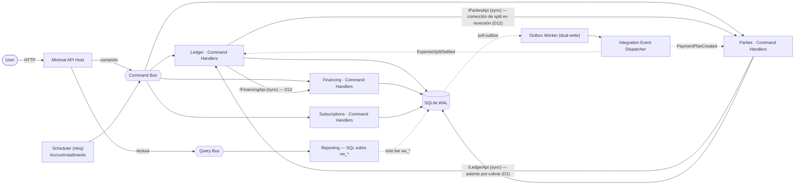

# Diseño Técnico Definitivo — Aplicación Personal de Finanzas

**Monolito Modular · CQRS · Event-Driven (Outbox) · SQLite · .NET 10**

> Documento único de referencia: requisitos, diseño de arquitectura y estructura de carpetas completa.

---

## 0. Decisiones de diseño

| # | Decisión |
|---|---|
| D1 | El Ledger es la única fuente de verdad contable. Incluye los "por cobrar" del titular como una cuenta de activo. `Parties` es la vista de gestión sobre esas cuentas, no un segundo libro mayor. |
| D2 | RF-4 separado en Devengo (`AccrueInstallments`) y Pago del resumen (`PayStatement`) |
| D3 | RF-6 vía asiento inverso (storno), Ledger append-only |
| D4 | RF-7: running balance expuesto como vista de línea de tiempo reconstruida en lectura (SQLite no tiene vistas materializadas) |
| D5 | El read side lee exclusivamente vistas `vw_*`, nunca tablas base de otro módulo |
| D6 | El Outbox se usa solo para dual-write disparado por transacción. El trabajo disparado por reloj (devengo, renovación) va a un **scheduler separado**, no al Outbox |
| D7 | SQLite en `WAL` + `busy_timeout` |
| D8 | RF-3 se resuelve con orquestación **eventual** entre Financing y Parties |
| D9 | RF-1 (débito **y efectivo**) usa el mismo criterio que D1: muestra la parte propia del titular |
| D10 | ~~RF-6 rechaza la reversión de un asiento que ya tiene pagos aplicados~~ — **superseded por D12** (PRD actualizado) |
| D11 | Frontera de autoridad de la deuda de tarjeta (Modelo B): el Ledger es autoritativo sobre el pasivo **devengado**; Financing sobre el **calendario futuro**. El devengo transfiere la propiedad de la cuota entre ambos. |
| D12 | RF-6 revisado: la reversión siempre se aplica, incluso con pagos aplicados, mediante asiento compensatorio + cascada a Financing y Parties |
| D13 | La API se diseña compatible con un futuro cliente Angular (CORS, envelope de error consistente, OpenAPI) sin comprometer la testeabilidad |

---

## 1. Principios de arquitectura

- **Monolito Modular**: un solo proceso, un solo `.sln`, cuatro bounded contexts aislados por ensamblado (`.Contracts` público + implementación `internal`).
- **CQRS**: Command Bus y Query Bus separados desde el Host. El write side vive en los módulos; el read side es un proyecto aparte (`Reporting`) que no escribe nada.
- **Event-Driven con Outbox**: los eventos de integración disparados por una transacción se escriben en la misma transacción que el cambio de dominio y se despachan después vía el Outbox Worker. El trabajo disparado por reloj (devengo, renovación) usa un scheduler, que es un mecanismo distinto — ver D6.
- **SQLite**: un solo archivo, un solo escritor real. `WAL` da lectores concurrentes, no escritores concurrentes.

> Este diseño es deliberadamente más pesado de lo que un gestor de gastos personal exige. El objetivo declarado es practicar diseño de API y una arquitectura modular con CQRS y mensajería sobre un dominio real, no minimizar el tiempo hasta el primer gasto registrado. Las decisiones se juzgan bajo ese objetivo: se conservan los patrones aunque el dominio no los requiera, y solo se corrige lo que estaría mal *dentro* del propio patrón — sobre todo la corrección contable del Ledger.

---

## 2. Decisiones de diseño

### D1 — El Ledger es la única fuente de verdad contable

El Ledger asienta el patrimonio del titular por partida doble, y un patrimonio incluye los derechos de cobro. Cuando el titular adelanta dinero de un gasto compartido, la parte de los terceros **es un activo del titular** (una cuenta por cobrar) y se asienta como tal en el Ledger. No se saca del Ledger: sacarla dejaba el efectivo sin reconciliar contra el banco real.

Ejemplo — gasto de $1.000 compartido 50/50, pagado desde el banco:
```
Dr  Gasto:Categoría            500
Dr  Activo:PorCobrar (tercero) 500
    Cr  Activo:Banco               1.000
```
El banco baja $1.000 (real), el gasto propio es $500, y el derecho de cobro de $500 queda registrado como activo. El patrimonio neto no cambia por la parte prestada (un activo se convirtió en otro), que es contablemente correcto.

`Parties` deja de ser un segundo libro mayor: pasa a ser la **vista de gestión** sobre las cuentas por cobrar del Ledger — con quién, running balance por persona, línea de tiempo. El `ExpenseSplit` y el `PhantomPennyAllocator` siguen siendo suyos, pero el saldo adeudado es un reflejo de las cuentas del Ledger, no un dato paralelo.

### D2 — Devengo y pago son operaciones distintas

- **`AccrueInstallmentsCommand`** — disparado por el **scheduler** (ver D6) al cerrar el ciclo de la tarjeta. Devenga el pasivo:
  ```
  Dr  Gasto:Categoría            1.000
      Cr  Pasivo:Tarjeta Visa        1.000
      (SplitReference -> ExpenseSplit #… si aplica)
  ```
- **`PayStatementCommand`** — endpoint explícito. Cancela el pasivo devengado contra el banco:
  ```
  Dr  Pasivo:Tarjeta Visa        3.000
      Cr  Activo:Banco               3.000
  ```
  El monto cobrado es **Σ de las cuotas devengadas, no revertidas y todavía impagas** del resumen — **no** el `MonthlyStatement.AmountDue` almacenado. `AmountDue` sólo se incrementa (nunca se descuenta), así que sigue incluyendo cuotas revertidas; pero revertir una cuota devengada ya bajó el `Pasivo:Tarjeta` del Ledger (storno, D3/D12). Cobrar el `AmountDue` almacenado sobre un resumen con una cuota revertida sobredebitaría el pasivo y sobregiraría del banco: sumar las cuotas vivas coincide con lo que el pasivo del Ledger ya refleja (mismo criterio que `GetCreditorPayables`, que filtra `IsReversed == false`). Es idéntico para resúmenes sin reversiones. Al pagar, cada cuota liquidada queda sellada con su propio `Installment.PaidOnUtc` y el resumen con el suyo; el pago de cuotas individuales es materia de `PayInstallmentCommand` (abajo). El saldo a favor arrastrado por reversión (D12) se netea contra ese monto, no contra el `AmountDue`.
- **`PayInstallmentCommand`** — endpoint explícito `POST /v1/financing/installments/{id}/pay`. Cancela **una** cuota devengada del resumen contra el banco, sin netear el saldo a favor de la tarjeta (eso queda sólo en `PayStatementCommand`):
  ```
  Dr  Pasivo:Tarjeta Visa        1.000
      Cr  Activo:Banco               1.000
  ```
  Sólo cuotas de tarjeta devengadas, no revertidas e impagas (si no → 409 `InstallmentAlreadyReversed` / `InstallmentAlreadyPaid` / `InstallmentNotAccrued`); id desconocido → 404. La transacción **no** lleva `InstallmentReference` (igual que `PayStatement` y el devengo por vencimiento de la parte del co-deudor — así el mapeo devengo→reversión no se vuelve ambiguo). Sella `Installment.PaidOnUtc`; si con eso quedan pagas todas las cuotas devengadas y no revertidas del resumen, sella también el `MonthlyStatement.PaidOnUtc`. Pagar una cuota y pagar el resumen entero conviven; como `PayStatement` ya cobra sólo Σ de las cuotas impagas (Slice 1), no hay ventana de doble pago. Detalle en `docs/individual-installment-payments/slice-2-pay-single-installment.md`.
- **`GetMonthlyStatementQuery`** — read model, sin efectos. `GET /v1/financing/statements/{id}` lista, antes de pagar, las cuotas ya devengadas que componen el `AmountDue` del resumen (RF-4 AC1): por cuota, plan / secuencia N de M / fecha de compra / ciclo / monto / si fue revertida / si está paga y su `PaidOnUtc`. Como `Installment.StatementId` sólo se asigna en el devengo, la respuesta es exactamente el pasivo contable ya reconocido (D11) — las cuotas futuras siguen en `GET /v1/financing/cards/{id}/future-schedule`.
- **`ListRecentPurchasesQuery`** — read model, sin efectos. `GET /v1/financing/purchases/recent` agrega a cada compra tres valores **derivados** de sus cuotas: `paidInstallmentCount` (cuántas tienen `PaidOnUtc`), el **mes de pago de la próxima cuota** — la cuota impaga, no revertida, más temprana por secuencia, proyectada por `BillingCycle.DueCycle` (nulo cuando no queda ninguna) — y `pendingAmountMinorUnits`, la **suma del monto de las cuotas impagas y no revertidas** (exactamente el mismo filtro que usa la próxima cuota, así una cuota revertida no cuenta ni como pendiente ni como "próxima"). No reprograma nada; sólo expone lo que ya existe, para que "Compras recientes" muestre "N/M pagadas · $X pendiente · próximo: `<mes>`". Detalle en `docs/individual-installment-payments/slice-3-next-payment-visibility.md` (cuenta + próximo mes) y `docs/backdated-expenses/slice-3-pending-amount.md` (monto pendiente).
- **`GetCreditorPayablesQuery`** — read model, sin efectos. `GET /v1/financing/creditor-payables` agrupa por acreedor las cuotas de los planes financiados por un acreedor y expone **dos** montos, ambos sólo sobre cuotas impagas (`PaidOnUtc is null`) y no revertidas: `dueNowMinorUnits` — Σ de las cuotas cuyo **mes de pago** (`DueCycle = Cycle.AddMonths(1)`, decisión 9) es igual o anterior al ciclo de acreedor en curso, con la mora de meses previos **plegada dentro** de esta cifra; y `totalOwedMinorUnits` — Σ de **todas** las cuotas impagas y no revertidas, futuras incluidas. Las pagas quedan fuera de ambas. El ciclo en curso es uniforme para todos los acreedores — `BillingCycleCalculator.ResolveCycle(hoy, PaymentPlan.CreditorCutoffDay).DueCycle`, comparado por ordinal de mes (`Year*12 + Month`, `BillingCycle` no tiene operador `<`) — y `hoy` sale del `TimeProvider` inyectado. El handler materializa con `ToListAsync` y filtra en memoria (la propiedad nullable convertida a valor no compara bien server-side en SQLite). `NextDueDate` y el desglose por cuenta **no** cambian en este corte — siguen sumando sobre todas las cuotas no revertidas, así que el sub-total por cuenta puede exceder `totalOwedMinorUnits` cuando hay cuotas pagas (cosmético, se ajusta en un corte posterior). Sin cambio de esquema ni migración. Detalle en `docs/owed-to-creditors/slice-1-current-cycle-outstanding.md` (+ `00-overview.md`).
- **`GetCreditorDetailQuery`** — read model, sin efectos. `GET /v1/financing/creditor-payables/{creditorId}` baja al detalle de **un** acreedor, agrupado por compra: cada `PaymentPlan` es una sección con su `Description`, `PurchaseDate`, `TotalMinorUnits` (Σ de las cuotas no revertidas del plan) y `OutstandingMinorUnits` (Σ de las impagas no revertidas), y debajo sus cuotas — secuencia, `InstallmentCount` para "cuota N de M", monto, **mes de pago** (`DueYear`/`DueMonth` = `Cycle.DueCycle`, decisión 9) y un `Status` por cuota: `reversed` → si no `paid` → si no, comparando el ordinal del mes de pago con el ciclo de acreedor en curso (`ResolveCycle(hoy, PaymentPlan.CreditorCutoffDay).DueCycle`, mismo cálculo que `GetCreditorPayablesQuery`): `< ` `overdue`, `== ` `due`, `> ` `future`. Los grupos se ordenan por `PurchaseDate` descendente (compra más reciente primero, como "Compras recientes"). La respuesta lleva un `Found` inicial (`GetMonthlyStatementQuery`): acreedor inexistente → `Found = false` y el host mapea `404 Financing.CreditorNotFound` (el `Error` se arma inline en el endpoint — el host no referencia `FinancingErrors` del ensamblado de implementación — y la regla de sufijo `*NotFound` de `ErrorHttpStatusHelper` lo lleva a 404). Sólo lectura: no toca el Ledger, no escribe. El botón "Pagar cuota" / "Deshacer" por fila y "Pagar la deuda completa" son cortes posteriores (Slices 3–4) y cuelgan de las filas que este corte dibuja. Sin cambio de esquema ni migración, sin arista nueva entre módulos (RNF-9 intacto). Detalle en `docs/owed-to-creditors/slice-2-creditor-detail-view.md`.
- **`PayCreditorInstallmentCommand` / `UnpayCreditorInstallmentCommand`** — pagar y deshacer el pago de **una** cuota de un plan financiado por un acreedor. El "pago" es **sólo de visualización**: sella (o limpia) `Installment.PaidOnUtc` con el reloj del servidor, **sin banco, sin asiento al Ledger, sin `MonthlyStatement`** — el espejo invocable por el usuario del sello retroactivo de la decisión 13 / Slice 2. Comandos sin `BankAccountId` ni fecha (`(Guid InstallmentId) : ICommand<Guid>`). El pago carga la cuota y su `PaymentPlan`; si el plan no tiene `CreditorId` (es de tarjeta) → 409 `Financing.NotACreditorInstallment` (el reflejo del guard `InstallmentNotAccrued` de la ruta de tarjeta, desde el otro lado); cuota revertida → 409 `InstallmentAlreadyReversed`; ya paga → 409 `InstallmentAlreadyPaid`; id desconocido → 404 `InstallmentNotFound`. El deshacer aplica los mismos guards de "es de acreedor" y "no revertida" y luego `Installment.ClearPayment()` (nuevo, inverso de `MarkPaid`); deshacer una cuota ya impaga es un **no-op exitoso** (recuperación de dedo gordo, no hay asiento que revertir). No hay `ILedgerApi`, no hay `InstallmentReference` en ninguna transacción (no hay transacción). Endpoints `POST /v1/financing/creditor-installments/{id}/pay` y `.../unpay`, ambos devuelven `200 Ok` con `{ installmentId }` (cambio de estado, no se crea un recurso). Sin cambio de esquema ni migración, sin arista nueva entre módulos (RNF-9 intacto). Detalle en `docs/owed-to-creditors/slice-3-pay-installment-and-undo.md`. **Superado en parte por D18** — desde `docs/partial-creditor-payments/slice-1-foundation-partial-installment.md`: el pago pasa a ser parcial u total (comando gana `AmountMinorUnits` opcional), `ApplyPayment`/`UndoLastPayment` reemplazan las llamadas directas a `MarkPaid`/`ClearPayment` de este párrafo, y deshacer una cuota sin pagos deja de ser un no-op — ahora es 409 `NoPaymentToUndo`.
- **`PayCreditorFullDebtCommand`** — saldar la deuda **entera** de un acreedor en una sola transacción: sella `Installment.PaidOnUtc` con el reloj del servidor en **todas** las cuotas impagas y no revertidas de **todas** las compras de ese acreedor — **sin banco, sin asiento al Ledger, sin movimiento de plata** (mismo modelo de visualización que el Slice 3). `PayCreditorFullDebtCommand(Guid CreditorId) : ICommand<int>` — devuelve la cantidad de cuotas **recién** saldadas (le da al cliente un "N cuotas saldadas"). El handler (ctor `(FinancingDbContext, TimeProvider)`, sin `ILedgerApi`) valida el `CreditorId` no vacío, verifica que el acreedor exista (`context.Creditors.AnyAsync`) → si no, `404 Financing.CreditorNotFound` (regla de sufijo `*NotFound`, sin entrada nueva en `ErrorHttpStatusHelper`); junta `context.Set<Installment>()` con `context.PaymentPlans` por `plan.CreditorId`, y por cada cuota `!IsReversed && !IsPaid` hace `MarkPaid(reloj)` contándola; `SaveChangesAsync`; devuelve el conteo. Cero cuotas por saldar → devuelve `0` (idempotente — la deuda ya estaba en cero, **no** es un error). **No hay "deshacer" masivo** — el `UnpayCreditorInstallmentCommand` por cuota del Slice 3 es la vía de recuperación. Endpoint `POST /v1/financing/creditor-payables/{creditorId}/pay-full`, devuelve `200 Ok` con `{ settledCount }` (cambio de estado, no se crea un recurso). Sin cambio de esquema ni migración, sin arista nueva entre módulos (RNF-9 intacto). Con esto se cierra la iniciativa `docs/owed-to-creditors/`. Detalle en `docs/owed-to-creditors/slice-4-pay-full-debt.md`. **Superado en parte por D18 (Slice 3)** — `PayCreditorFullDebtCommand` gana `AmountMinorUnits`/`CurrencyCode` opcionales y el camino `null` pasa de `MarkPaid` a `ApplyPayment(remaining)`, igual que el resto de las rutas de pago de acreedor.
- **`CreatePaymentPlanCommand` retroactivo (compra de tarjeta con fecha pasada)** — cuando el plan es de **tarjeta** y su `PurchaseDate` es anterior a hoy, `CreatePaymentPlanHandler` corre el devengo y el pago de las cuotas ya vencidas **en el mismo momento de crear el plan**, no en un tick del scheduler, para que "Compras recientes" y la lista de resúmenes queden correctas al instante. Por cada cuota cuyo ciclo de cierre ya cerró (`BillingCycle.IsClosedAsOf(hoy, corte)`, en orden ascendente hasta el primer ciclo no cerrado): **(1) devenga** igual que la Compuerta 1 de `AccrueInstallments` — `Dr Gasto:Tarjeta / Cr Pasivo:Tarjeta`, pero **fechado en la fecha de corte histórica** de ese ciclo, más `statement.Accrue` sobre el `MonthlyStatement` (nuevo o existente) y `Installment.MarkAccrued`; **(2) paga**, sólo si el mes de pago de la cuota es estrictamente anterior al mes en curso — `Dr Pasivo:Tarjeta / Cr Activo:Banco` fechado en la fecha de vencimiento histórica, `Installment.MarkPaid`, y `MonthlyStatement.MarkPaid` si con eso quedan pagas todas sus cuotas. El banco que fondea esos pagos viene en el nuevo `BankAccountId` del comando (la ruta de pago no tiene banco por defecto); es **obligatorio** sólo cuando la compra de tarjeta es retroactiva y tiene al menos una cuota vencida. Se rechaza `PurchaseDate > hoy` en todos los modos (`FuturePurchaseDate`, 422). Los asientos al Ledger son cross-módulo sin saga (mismo contrato que el scheduler y `PayInstallmentCommand`). La cuota del mes en curso se devenga pero **no** se paga (queda "pendiente este mes"). Como las cuotas pre-liquidadas quedan con `AccruedOnUtc` / `PaidOnUtc`, la Compuerta 1 del scheduler las saltea; `SplitAccruedOnUtc` se deja en nulo, así la Compuerta 2 sigue devengando la parte del co-deudor por vencimiento sin cambios. Detalle en `docs/backdated-expenses/slice-1-card-backdating.md`. **Modo acreedor (Slice 2):** `PaymentPlan.Create` resuelve el primer ciclo del plan de acreedor con `BillingCycleCalculator.ResolveCycle(purchaseDate, 26)` (constante `PaymentPlan.CreditorCutoffDay`), igual que las tarjetas — una compra posterior al 26 rueda al ciclo siguiente, de forma **uniforme** (no sólo las retroactivas). Y al crear un plan de acreedor con `purchaseDate` pasada, `CreatePaymentPlanHandler` marca `Installment.MarkPaid` en cada cuota cuyo mes de pago ya pasó — **sólo el sello `PaidOnUtc`, sin asiento al Ledger, sin devengo, sin `MonthlyStatement`, sin banco** (la deuda con un acreedor no tiene huella contable para el titular en ninguna parte; no existe comando "pagar al acreedor"). No se toca `SplitAccruedOnUtc`, así la Compuerta 3 (`accrueDueCreditorSplitReceivablesAsync`) sigue devengando la parte del co-deudor por vencimiento sin cambios. Un libro mayor completo de acreedores es una iniciativa aparte. Detalle en `docs/backdated-expenses/slice-2-creditor-cutoff.md`.

### D3 — Reversión vía asiento inverso

El Ledger es append-only: no se edita ni se borra ningún asiento. Una reversión genera una `Transaction` nueva con débitos y créditos espejados, con `OriginalTransactionId` apuntando al asiento original. Una reversión no puede revertirse — evita loops.

### D4 — Cuentas corrientes con "gravedad contable"

Una `CurrentAccount` por persona, cuyo saldo es un reflejo de las cuentas por cobrar del Ledger (D1). Las deudas cruzadas se netean solas porque son signos opuestos sobre el mismo saldo. El endpoint de liquidación (`POST /parties/{id}/settle`) aparece cuando hay transferencia real de dinero, y asienta la **cancelación del activo por cobrar** — no un ingreso, porque cobrar lo que te deben no aumenta el patrimonio:
```
Dr  Activo:Banco               6.000
    Cr  Activo:PorCobrar (tercero)   6.000
```
El running balance se expone como una vista de línea de tiempo que reconstruye los movimientos ordenados **en tiempo de lectura**. SQLite no tiene vistas materializadas; no se promete persistencia del saldo agregado, se recalcula al consultar.

### D5 — El read side lee vistas, no tablas base

`Reporting` no conoce el esquema interno de ningún módulo: cada módulo publica vistas `vw_*` como parte de su superficie pública estable. Si un módulo refactoriza sus tablas internas, mantiene la vista y `Reporting` no se entera.

### D6 — Outbox y scheduler son mecanismos distintos

El patrón Outbox resuelve el **dual-write disparado por una transacción**: persistir un cambio de dominio y publicar un evento de forma atómica. En este sistema, el único caso genuino es el split de RF-3 (D8): una transacción crea el plan y debe emitir un evento sin riesgo de perderlo.

El **devengo de cuotas** (D2) no se dispara por una transacción, se dispara por un **reloj** (cierre de ciclo). Eso es un scheduler, no un Outbox. Confundirlos lleva a usar Outbox donde corresponde un cron. Se modela como `BackgroundService` (`AccrueInstallments`) que emite comandos; el Outbox Worker es otro `BackgroundService`, dedicado solo a drenar las tablas `*_outbox_messages`. **Suscripciones ya no usa este mecanismo** (ver RF-5, revisado por `docs/subscriptions-rework/`): el scheduler `RenewDueSubscriptions` que renovaba por reloj fue eliminado — el usuario paga cada período de forma explícita (`POST /v1/subscriptions/{id}/pay`, Slice 2), o el registro lo marca pagado si el ancla del ciclo actual ya venció (Slice 1).

### D7 — SQLite en WAL + busy_timeout

La API, el Outbox Worker y los schedulers escriben en el mismo archivo. Sin esto, el primer `SQLITE_BUSY` bajo concurrencia mínima es cuestión de tiempo, no de probabilidad.

### D8 — RF-3 se resuelve con orquestación eventual

`Financing.CreatePaymentPlanCommand` crea siempre el plan de pago. Si el comando incluye división entre terceros, `Financing` publica `PaymentPlanCreatedIntegrationEvent` con el detalle bruto del reparto en su propio Outbox, dentro de la misma transacción que crea el plan (este sí es un dual-write legítimo, D6).

El Outbox Worker despacha el evento; `Parties` lo consume en `OnPaymentPlanCreated`, aplica el `PhantomPennyAllocator`, crea el `ExpenseSplit` y solicita al Ledger el asiento de las cuentas por cobrar (D1), deduplicando contra su inbox. El plan de pago existe de inmediato; el split y sus por-cobrar se reflejan con el delay del Worker.

**Consecuencia aceptada:** hay una ventana en la que el plan existe sin que el split se haya registrado. Ver RNF-7 para el mecanismo de detección.

### D9 — RF-1 usa el mismo criterio que D1

El resumen mensual de gastos débito **y efectivo** muestra la parte propia del titular — el gasto real incurrido — no el total desembolsado cuando una parte es un préstamo a terceros (que es un activo, no un gasto). Débito y efectivo se agrupan bajo el mismo `AccountKind` de "ya gastado, sin ciclo de facturación futuro" (ver D12/§6, `AccountKind.cs`) — a diferencia del crédito, que sí es un compromiso futuro (D11).

El gasto de tarjeta se aísla de ese resumen por un `AccountKind` propio, no por convención de nombres: cada tarjeta provisiona su cuenta de compras como `AccountKind.CardPurchases` (distinta de `Expense`, que queda para el gasto propio directo — débito, efectivo, suscripciones). `vw_ledger_monthly_expenses` filtra `Type = 'Expense' AND Kind NOT IN ('Receivable', 'CardPurchases')`, así que ni la parte del tercero ni el devengo de una cuota de tarjeta entran en el total de "débito y efectivo" que US-1 AC2 pide separar del crédito.

### D10 — La reversión se rechaza si hay pagos aplicados *(superseded — ver D12)*

> **Nota de revisión:** este texto se conserva sin editar por trazabilidad histórica (igual que un asiento revertido en el propio Ledger no se borra). El PRD actualizado (US-6) requiere que la reversión funcione incluso con pagos aplicados. El comportamiento vigente es el de **D12**, no el descrito acá.

`ReverseTransactionHandler` rechaza la operación si la transacción a revertir es un devengo y el installment asociado ya tiene un pago aplicado. La verificación se hace vía llamada síncrona a `IFinancingApi`, consultando el estado del installment referenciado.

**Consecuencia aceptada (histórica, ya no vigente):** el sistema no ofrece una operación para "deshacer un pago". Un asiento devengado y ya pagado queda inmutable; cualquier corrección en ese escenario requiere intervención manual.

### D11 — Frontera de autoridad de la deuda de tarjeta (Modelo B)

La deuda de tarjeta no vive duplicada: cada representación tiene un dominio temporal que no se solapa.

- **Pasivo devengado (cuotas ya incurridas e impagas)** → autoridad del **Ledger**. Es el saldo de `Pasivo:Tarjeta`. Responde "¿cuánto debo *ahora*?".
- **Calendario futuro (cuotas aún no devengadas)** → autoridad de **Financing**. Es la suma de installments pendientes. Responde "¿cuánto me falta *en total*?".

El **evento de devengo** (D2) es el instante en que una cuota deja de ser un compromiso futuro de Financing y se convierte en pasivo contable del Ledger. Antes de devengarse, una cuota no es un pasivo: es una promesa.

**Consecuencia aceptada:** al comprar algo en 3 cuotas, el Ledger no muestra un pasivo de inmediato — muestra $0 hasta que cierra el primer ciclo, y el pasivo crece cuota a cuota. El patrimonio neto según el Ledger baja mes a mes, no de golpe al comprar. La pregunta "¿cuánto debo en total, contando lo no devengado?" se responde en `Reporting` cruzando la vista de pasivo del Ledger con la de calendario de Financing — no en ningún módulo por separado.

**Mes de pago vs. mes de cierre (PRD decisiones 9–10).** Lo almacenado en la cuota es el **ciclo de cierre** (identidad del `MonthlyStatement`, sin migración). Las superficies **de pago** — el bloque "Programado" del tercero (`GetFuturePartyShares`), el calendario futuro de la tarjeta (`GetCardFutureSchedule` / `vw_card_future_schedule`) y el "deuda por ciclo" del panel — proyectan `DueCycle = Cycle.AddMonths(1)` en la lectura; las superficies **de resumen** siguen mostrando el ciclo de cierre. En un gasto compartido, la cuenta por cobrar del co-deudor se **devenga al llegar `DueCycle`**, no al cerrar el ciclo, en un segundo gate de `AccrueInstallments` marcado con `Installment.SplitAccruedOnUtc`. El modo **financiado por un acreedor** se unifica bajo la misma regla: `PaymentPlan.Create` guarda el **mes de la compra** como ciclo, de modo que la proyección `+1` da la primera cuota el mes siguiente sin ramas tarjeta-vs-acreedor; su parte de co-deudor arranca en $0 y se devenga por vencimiento en el **mismo** scheduler (un tercer gate que asienta `Dr PorCobrar_k / Cr CreditorPayable`, mismo marcador `SplitAccruedOnUtc`), en vez del asiento por adelantado y el scheduler paralelo que había antes. `BillingCycleCalculator.ResolveCycle` y el devengo del titular no cambian. La **lista** de terceros consume además una versión agregada de esa proyección — `GetPendingSharesByParty` (Financing, misma población y reparto que `GetFuturePartyShares`, sumada por tercero; `GET /v1/parties/pending-shares`) — para distinguir un tercero saldado de uno con $0 asentado pero cuotas por venir; no toca el devengo ni el libro (PRD decisión 11).

**Día de cierre editable (Fase 55, `docs/friendly-ui/slice-6-closing-date.md`).** `CreditCard` guarda un **día de cierre habitual** (`ChangeUsualClosingDay`) y filas hijas `ClosingOverride` por mes (`financing_card_closing_overrides`, único `(CardId, CycleYear, CycleMonth)`). El resolvedor `CreditCard.ClosingDayOf` / `ClosingDateOf` / `ResolveCycle` / `IsClosedAsOf` reemplaza toda lectura de un `int cutoffDay` (`AccrueInstallments`, `CreatePaymentPlanHandler` incluido el devengo retroactivo, `GetCardPurchasesHandler`, `ListCreditCards`); el modo acreedor sigue con `PaymentPlan.CreditorCutoffDay = 26` y `PaymentPlan.Create` recibe un `firstCycle` opcional al final. Un mes queda **bloqueado** cuando existe un `MonthlyStatement` de esa tarjeta y ciclo (`Financing.ClosingMonthLocked`, 409; sólo aplica a fijar/borrar un override, el cambio del día habitual no se valida contra el bloqueo). Toda edición **re-asigna** los planes abiertos con `CardRebucketer`: desplaza todas las cuotas de un plan por la diferencia de meses; si alguna cuota de un plan que se movería ya fue devengada, se rechaza con `Financing.ClosingChangeMovesChargedPurchase` (409) y no se persiste nada. Un día fuera de rango devuelve `Financing.InvalidClosingDay` (422). Las vistas de Reporting leen las columnas de ciclo almacenadas en la cuota, por lo que el re-armado no requiere cambios de vista. **Limitación aceptada:** el día de cierre pertenece siempre al mes del ciclo (no hay cierre que caiga en el mes siguiente). Consulta: `GetCardClosingScheduleQuery` (`GET /v1/instruments/cards/{id}/closing-dates`, desde el primer mes abierto — sin resumen para ese ciclo, contado desde el mes calendario actual —; `Found` falso -> 404); escrituras `PUT /v1/instruments/cards/{id}/closing-day` y `PUT|DELETE .../closing-dates/{year}/{month}`; `InstrumentRowDto.nextClosingDate`.

**Identidad de tarjeta compartida entre las dos vistas.** El pasivo devengado lo publica el Ledger (`vw_card_liability_accrued`) y el calendario futuro lo publica Financing (`vw_card_future_schedule`); para que `Reporting` pueda cruzarlas por tarjeta y no solo etiquetar dos buckets, la cuenta `Pasivo:Tarjeta` del Ledger lleva el `CardId` de Financing como referencia opaca (`OwnerReferenceId` en `CreateAccountCommand` / `Account`, un `Guid?` sin tipo cruzado — mismo patrón que `SubscriptionReferenceId` en `PostTransactionCommand`). `vw_card_liability_accrued` lo expone en minúsculas (`lower(...)`) como `CardId`, y `card_due_by_month.sql` lo arrastra en ambas mitades del `UNION`, de modo que los buckets `Accrued` y `Future` comparten una clave por tarjeta estable ante mayúsculas/minúsculas. Para la **etiqueta visible**, la mitad `Future` usa el nombre real de la tarjeta (`vw_card_future_schedule` hace `JOIN` a `financing_credit_cards` para exponer `CardName`, y `card_due_by_month.sql` selecciona `CardName AS Card` en vez del GUID crudo), de forma que ambos buckets muestran un nombre y no solo la mitad `Accrued`.

### D12 — Reversión completa con asiento compensatorio (supersede D10)

El PRD (US-6) exige que revertir un gasto funcione incluso sobre cuotas ya devengadas y pagadas, y que la deuda de un tercero se corrija automáticamente si el gasto revertido estaba repartido. `ReverseTransactionHandler` deja de rechazar la operación; en cambio:

1. **Siempre** postea el asiento storno espejado contra el asiento original (D3 no cambia — sigue sin poder revertirse una reversión).
2. Si `IFinancingApi` informa que el installment ya fue pagado vía un resumen (`MonthlyStatement`), postea **además** un asiento compensatorio:
   ```
   Dr  Activo:CréditoTarjeta (Visa)   1.000
       Cr  Pasivo:Tarjeta (Visa)          1.000
   ```
   El storno del paso 1 se postea **siempre**, así que ya espejó el devengo original (`Dr Pasivo:Tarjeta / Cr Gasto:Categoría`): el gasto quedó revertido y el pasivo devengado, bajado. Volver a acreditar `Gasto:Categoría` acá lo contaría dos veces; el compensatorio, en cambio, reconstruye el pasivo y estaciona el saldo a favor en un activo de tarjeta (`Activo:CréditoTarjeta`) listo para netear. Tampoco se acredita `Activo:Banco` directamente — hacerlo violaría RNF-5 (el banco solo refleja desembolsos reales; acá no hubo un ingreso real de dinero, el banco no devuelve nada todavía).
3. Ese crédito de tarjeta se **descuenta automáticamente** del próximo `PayStatementCommand` de esa tarjeta — no es un ajuste manual. Esto es necesario para cumplir US-2 AC2 (el monto a pagar debe coincidir con lo que el banco real factura, y un resumen real neta un crédito previo contra el mes siguiente). `CreditCard`/`MonthlyStatement` necesitan un campo de saldo a favor arrastrado (ver §6).
4. Si el asiento original tenía un `SplitReference`, Ledger llama sincrónicamente a `IPartiesApi` (nuevo arco, ver §5.3) para corregir la cuenta corriente del tercero afectado, en la misma operación — simétrico al arco síncrono Parties→Ledger de D1 y al arco síncrono Ledger→Financing que ya existía en D10. Esta corrección es **solo de metadatos**: el storno del paso 1 ya espejó las patas `Cr Activo:PorCobrar`, con lo que el saldo del tercero ya quedó corregido en el Ledger; `CorrectExpenseSplitHandler` únicamente avanza `ExpenseSplit.ReversedReceivable` y no postea ningún asiento (RNF-5). Si la llamada falla, se registra una advertencia y la reversión igual se completa (sin saga).
5. Financing marca el installment como revertido (vía una mutación nueva en `IFinancingApi`) para que deje de aparecer en `vw_card_future_schedule` y en el pasivo devengado, sin importar si ya había sido devengado o pagado.

**Consecuencia aceptada (más acotada que la de D10):** esto no devuelve efectivo real de inmediato — genera un crédito a favor contra los próximos resúmenes de esa tarjeta. Si hiciera falta un reintegro real e inmediato (por ejemplo, la tarjeta se está dando de baja y no habrá un "próximo resumen" contra el cual netear), esa situación sigue requiriendo intervención manual.

### D13 — La API se diseña compatible con un futuro cliente Angular

Por ahora la API es de consumo puro (Swagger/Postman), sin autenticación más allá de proteger el acceso a la aplicación en sí (PRD §4). Hay un cliente Angular planeado, así que el host se diseña compatible con ese consumo sin comprometer la testeabilidad de los endpoints:

- **CORS** habilitado para el origen del cliente Angular (configurable, no hardcodeado).
- **Envelope de error consistente** en todas las respuestas 4xx/5xx, derivado de `SharedKernel.Error` (`Code`, `Message`, `Metadata`) — un único middleware/filter en el Host, no lógica duplicada por endpoint.
- **OpenAPI** completo (ya presente en el scaffold vía `Microsoft.AspNetCore.OpenApi`) con detalle suficiente para que un futuro generador de cliente TypeScript lo consuma.

**Implementación (Fase 8).** El envelope es un `ProblemDetails` RFC-9457 enriquecido (no un body propio): `Error.Code` → `extensions["code"]`, `Error.Message` → `detail`, `Error.Metadata` fusionado en extensions (`code`/`status` quedan en la raíz del body, no anidados). El status HTTP se deriva del código con una función pura — `src/Bootstrap/PersonalFinance.Api/Endpoints/ErrorHttpStatusHelper.cs`, **fuente de verdad** del mapeo: sufijo `NotFound` → 404; conflicto de estado (`AlreadyPaid`/`AlreadyAccrued`/`AlreadyReversed`/`NotActive`/`CannotReverseAReversal`/`SettlementExceedsBalance`) → 409; validación de dominio (`Invalid*`/`NonPositive*` y el set catalogado) → 422; resto → 400. `ProblemResultsHelper.From(Error)` lo construye; `GlobalExceptionHandler` cubre lo no controlado (`FormatException`/`ArgumentException` de la capa de mapeo → 400 `Request.Malformed`; resto → 500 `Server.Unhandled`, detalle genérico fuera de Development). Todo `POST` que crea un recurso responde `201` sin header `Location`. CORS: sección `Cors:AllowedOrigins` de `appsettings` → política `"client"`. OpenAPI servido siempre en `/openapi/v1.json` (la UI Scalar queda sólo en Development). `/health` expone `OutboxHealthCheck` vía `MapHealthChecks` (Healthy/Degraded → 200, Unhealthy → 503).

**Registro de instrumentos de pago como una sola acción.** El PRD (§6, prerrequisito transversal) modela el alta de un banco/tarjeta como una única acción del usuario, donde se elige el tipo (débito, crédito, efectivo). Técnicamente, débito/efectivo son `Account` (Ledger) y crédito es `CreditCard` (Financing) — dos agregados en dos módulos distintos. Para no romper el aislamiento de módulos ni inventar un agregado compartido, la solución es un endpoint único a nivel Bootstrap — `POST /instruments` — que no tiene lógica de dominio propia: solo enruta al comando correcto (`CreateAccountCommand` vía `ILedgerApi`, o `CreateCreditCardCommand` vía `IFinancingApi`) según el `type` recibido. El Bootstrap host ya depende de los `.Contracts` de todos los módulos para exponer sus endpoints, así que este enrutamiento no agrega una dependencia nueva entre módulos.

### D14 — Soporte multi-moneda sin conversión (no-FX)

`docs/dollar-support/` agrega USD como segunda moneda soportada. La decisión de diseño, tomada antes de escribir código (`00-overview.md`): **nunca convertir entre monedas**. No hay tasa de cambio en ningún lado del sistema — ni fija ni consultada a un servicio externo. Cada operación que hoy asume ARS implícitamente debe, en cambio, **particionar por moneda primero** y nunca sumar montos de monedas distintas entre sí.

- **La moneda vive en el registro, no en la cuenta.** `Money` ya cargaba una `Currency` (con `ensureSameCurrency` guardando cada operación aritmética — el candado a nivel de dominio). La Fase 41 lo hace real en persistencia: `Entry` (la fila atómica de plata de todo el sistema) ahora persiste su propia `CurrencyCode`, no la hereda de la cuenta.
- **Las cuentas son poli-moneda.** Una `Account` (banco, efectivo, categoría de gasto) puede tener `Entry`s en ARS y en USD simultáneamente — no existe "la moneda de la cuenta". `GetAccountBalanceQuery` refleja esto devolviendo una lista de `Money` (una por moneda con movimientos), no un escalar.
- **Conjunto cerrado.** `Currency.FromCode(string)` solo reconoce `"ARS"` (alias `Reference`) y `"USD"` — cualquier otro código lanza. Agregar una tercera moneda es una decisión de diseño explícita, no un string libre.
- **Toda agregación cross-currency debe agrupar por moneda antes de sumar.** Las vistas de solo-lectura que antes hardcodeaban `'ARS' AS CurrencyCode` (`vw_ledger_balances`, `vw_ledger_monthly_expenses`, y desde la Fase 42 también `vw_card_future_schedule`/`vw_card_liability_accrued`) ahora seleccionan la columna real y la agregan al `GROUP BY` — el mismo criterio que D9/RF-1 ya aplicaba para excluir `CardPurchases`, extendido a moneda.
- **Un `MonthlyStatement` es de una sola moneda (Fase 42).** `AmountDue` solo se incrementa (`Accrue`: `AmountDue += installment.Amount`), y esa suma lanza si las monedas no coinciden — por lo tanto un resumen no puede mezclar cuotas en ARS y en USD. `MonthlyStatement.Open` recibe la moneda al crearse y el índice único pasa a `(CardId, CycleYear, CycleMonth, CurrencyCode)`, así una tarjeta puede tener un resumen ARS y un resumen USD en el mismo ciclo, cada uno su propio agregado.
- **Alcance de la Fase 41 (Slice 1 de 4):** solo el camino débito/efectivo (`RecordDebitExpense`) posteaba en USD elegido por el usuario; tarjetas, suscripciones y terceros (Parties) seguían asumiendo ARS hasta sus propias slices. **Fase 42 (Slice 2 de 4) suma tarjetas:** `CreatePaymentPlanCommand` acepta `CurrencyCode`, la división en cuotas es agnóstica a la moneda (opera sobre `MinorUnits`, la moneda solo viaja con el resultado), y `GetCardLiability` devuelve un `Money` por moneda. **Fase 43 (Slice 3 de 4) suma suscripciones — y ejecuta la migración de datos existentes.** `SubscriptionTemplate.Amount` pasa al mismo patrón de dos columnas (`AmountMinorUnits` + `Currency`) que `PaymentPlan.Total`/`Entry`; `CreateSubscriptionTemplateCommand` acepta `CurrencyCode`. **El flip es una decisión de producto tomada antes de escribir código, irreversible una vez aplicada:** toda suscripción existente pasa a USD (siempre se pagaron en dólares) — la plantilla y las dos patas de cada transacción del Ledger que tenga `SubscriptionReferenceId` (reversiones incluidas, porque `Transaction.Reverse` copia la referencia) —, mediante dos migraciones de solo-datos aplicadas juntas: `FlipSubscriptionsToUsd` en el contexto Subscriptions (`UPDATE subscriptions_templates`) y `FlipSubscriptionLedgerEntriesToUsd` en el contexto Ledger, que es quien posee `ledger_entries` (`UPDATE ... WHERE TransactionId IN (SELECT Id FROM ledger_transactions WHERE SubscriptionReferenceId IS NOT NULL)`). Cada transacción sigue balanceando dentro de USD porque ambas patas flipean juntas. Consecuencia aceptada: la cuenta de fondeo compartida (banco/efectivo) queda poli-moneda — el mismo modelo que ya describe el punto anterior, ahora con un caso real. **Fase 44 (Slice 4 de 4, cierra la iniciativa) suma Terceros (Parties) — el corte conceptualmente más pesado, porque acá la moneda multiplica la dimensión de saldo, no solo la de visualización:** un tercero puede terminar debiendo **dos** saldos de cuenta corriente simultáneos, uno por moneda, y liquidar uno no debe tocar el otro. `ExpenseSplit` pasa al mismo patrón de dos columnas, pero compartido entre sus cuatro campos `Money` (`Total`/`HolderShare`/`AccruedReceivable`/`ReversedReceivable`) — todos comparten una única `CurrencyCode` de split, ya que un split es de una sola moneda; `ExpenseSplitParticipant.Share` hereda esa moneda vía su propia columna (no vía un `HasConversion` que cruce entidades). `RegisterSharedExpenseCommand`/`SettleCurrentAccountCommand` aceptan `CurrencyCode` (cerrado, si no `Parties.InvalidCurrencyCode` → 422); el reparto de pesos entre participantes sigue siendo agnóstico a la moneda. `GetCurrentAccountBalanceQuery` devuelve una lista de `Money` por moneda, igual que `GetAccountBalance` desde la Fase 41. **Bug real encontrado y corregido, más allá de la letra de la slice:** `vw_receivable_account_movements` particionaba su saldo corriente (`SUM(...) OVER (PARTITION BY AccountId ...)`) solo por cuenta — para un tercero poli-moneda esto mezclaba movimientos ARS y USD en una sola serie; ahora particiona por `(AccountId, CurrencyCode)`. **Esto cierra `docs/dollar-support/` — la iniciativa está completa.**

---

### D15 — Ingreso de dinero: `Dr Bank/Cash / Cr Income`, una sola cuenta, sin categorías

`docs/incomes-support/` agrega la primera forma de registrar dinero **entrante**. Hasta ahora el Ledger solo modelaba salidas de plata (gastos) y movimientos entre cuentas propias/terceros; un ingreso real (sueldo, reintegro, regalo) no tenía dónde asentarse.

- **Un ingreso es plata real a una cuenta Bank/Cash.** No es un reembolso de tarjeta (las reversiones ya lo cubren) ni el pago de un tercero (`SettleCurrentAccountCommand` liquida una deuda, no es una ganancia) — la decisión de producto distingue explícitamente estos tres casos para que "ingreso" siga significando *plata que gané*.
- **Asiento simple, sin devengo.** `Dr` la cuenta Bank/Cash elegida `/ Cr` una única cuenta `Income` (`AccountType.Income` + `AccountKind.Income`, ambos ya existían sin uso desde el diseño original) — creada perezosamente en el primer ingreso (`IncomeAccountProvisioning`, el mismo patrón get-or-create que `ExpenseCategoryProvisioning`, pero sin categorías: no hay `IncomeAccountName`, siempre es la misma cuenta).
- **Sin categorías, sin recurrencia.** YAGNI explícito — si algún día se quiere un desglose "por fuente", es una decisión de diseño futura, no una que este slice anticipe. Cada ingreso es una carga manual, puntual; no hay scheduler (el de Suscripciones se acaba de eliminar por el bug de auto-cobro, ver decisión 15 del PRD — no hay apetito por reintroducir ese patrón acá).
- **Fecha no futura, back-dating permitido.** Mismo criterio que `RecordDebitExpense` (`Financing.FuturePurchaseDate`), pero como código propio de Ledger (`Ledger.IncomeDateInFuture`) porque el validador estático no tiene reloj — el guard vive en el handler, inyectando `TimeProvider`.
- **La reversión de un ingreso ya funciona sin cambios.** Es un asiento balanceado común; `Transaction.Reverse` lo revierte como cualquier otro. Slice 3 (`docs/incomes-support/slice-3-undo-income.md`) agrega el guard de doble reversión y el botón en el cliente — no un mecanismo nuevo.
- **`Transaction.Description` persiste por primera vez (arregla un bug verificado, no es parte del alcance de "ingresos" en sí).** `RecordDebitExpenseHandler` (rama sin split) y `PostTransactionHandler` recibían una descripción y la descartaban silenciosamente — `RegisterSharedExpenseHandler` (split) y `SettleCurrentAccountHandler` ya la enviaban, sin efecto. Como la descripción de un ingreso es su única etiqueta legible y la tabla "Money Flow" de la Slice 2 depende de ella, el fix se adelantó a este slice en lugar de esperar una iniciativa propia. Las filas históricas no se pueden recuperar — el dato nunca se guardó.
- **Vista de solo lectura, espejo de `vw_ledger_monthly_expenses`.** `vw_ledger_monthly_incomes` sigue el mismo criterio D9/RF-1 (agrupar por `AccountKind` correcto, particionar por moneda) pero en sentido crédito-positivo; una reversión anula su propio mes automáticamente porque el storno debita `Income`, igual que Out of pocket.

---

### D16 — La tabla "Money Flow" reutiliza los filtros de D9/D15, no inventa un tercero

`docs/incomes-support/slice-2-money-flow-table.md` (Slice 2) agrega una vista mensual, estilo libro contable, donde cada fila es un movimiento de plata propia — una fila **Outcome** o una fila **Income**, nunca ambas. La decisión de diseño central es **no inventar un tercer criterio de filtrado**: reutilizar bit-a-bit los dos que ya existen y ya están probados.

- **El lado Outcome es exactamente el filtro de `vw_ledger_monthly_expenses`.** Débito a una cuenta `Expense`-tipo cuyo `Kind` no es `Receivable` ni `CardPurchases` (D9/RF-1) — así una compra dividida muestra solo la parte propia del titular, igual que "Out of pocket", sin duplicar esa lógica en un segundo lugar.
- **El lado Income es exactamente el filtro de `vw_ledger_monthly_incomes`.** Crédito a la única cuenta `Income` (D15).
- **Las cuotas de tarjeta, los pagos de resumen y las liquidaciones a terceros quedan afuera sin necesidad de un `WHERE` extra.** Una acreencia de `CardPurchases` (Kind excluido de Outcome) y el pago del resumen (`Dr Pasivo:Tarjeta / Cr Activo:Banco`, ninguna pata es `Income` ni `Expense` no-`Receivable`) suman cero en ambos lados — la fila se descarta por el propio `HAVING IncomeMinorUnits > 0 OR OutcomeMinorUnits > 0`, no por una exclusión explícita. Es deliberado (ver decisión 17 del PRD): esos movimientos se cargan a mano como gasto débito/efectivo cuando efectivamente se pagan.
- **Un par revertido se oculta entero, sin importar el mes de cada pata.** `WHERE t.OriginalTransactionId IS NULL AND NOT EXISTS(...)` excluye tanto la transacción original como su storno.
- **Diferencia aceptada y documentada, no corregida, con "Out of pocket": el storno fecha con el reloj, no con el mes original.** `ReverseTransaction` fecha la reversión en `DateTimeOffset.UtcNow` (no en el mes del movimiento original). Revertir en septiembre un gasto de agosto hace que Out of pocket muestre `+X` en agosto y `−X` en septiembre (dos meses, dos filas), mientras que Money Flow oculta ambas patas en cualquier mes que se consulte. Una reversión en el mismo mes reconcilia igual en los dos reportes; el caso cross-month es la única divergencia, y se documenta en el header de la vista SQL en lugar de "arreglar" `vw_ledger_monthly_expenses` — ese cambio queda fuera de esta iniciativa.
- **La descripción cae a la categoría cuando no hay una propia.** `COALESCE(t.Description, <nombre de la cuenta de gasto>, 'Income')` — una fila anterior a la Fase 45 (sin `Description` persistida) muestra su categoría, igual que decidió D15's fix retroactivo.

---

### D17 — Deshacer un ingreso: la reversión existente + un guard global de doble reversión

`docs/incomes-support/slice-3-undo-income.md` (Slice 3, cierra la iniciativa) agrega un botón "Undo" en las filas de ingreso de Money Flow. No hay mecanismo nuevo — es la reversión de Ledger que ya existe (`POST /v1/ledger/transactions/{id}/reversal`); lo único que faltaba era cerrar un agujero que esa reversión siempre tuvo.

- **`ReverseTransactionHandler` bloqueaba revertir una reversión (`CannotReverseAReversal`), pero nada bloqueaba revertir el mismo original dos veces.** El índice sobre `OriginalTransactionId` no es único (`TransactionConfiguration.cs`). Hasta ahora ese agujero solo era alcanzable desde `reverse-movement-page`; un botón de un solo click (doble click o una pestaña vieja) podía postear dos stornos, dejando el ingreso contado como negativo.
- **El fix es un `AnyAsync` global, no acotado a ingresos.** Antes de `Transaction.Reverse(...)`, el handler chequea si ya existe una transacción con `OriginalTransactionId == original.Id`; si existe, devuelve el nuevo `LedgerErrors.TransactionAlreadyReversed` (409, el mismo precedente que `InstallmentNotAccrued`/`NotACreditorInstallment`). El guard aplica a **toda** reversión — gastos incluidos — porque el agujero era el mismo para cualquier transacción, no solo ingresos.
- **Check-then-insert, no una transacción serializada.** Con un único usuario la ventana de carrera entre el `AnyAsync` y el `SaveChanges` del storno es negligible; el camino de mejora si algún día hay escritores concurrentes es un índice único filtrado sobre `OriginalTransactionId` (una migración) — deliberadamente no implementado en esta slice.
- **Sin endpoint nuevo, sin migración.** El cliente reutiliza `LedgerService.reverse(transactionId)`, la misma llamada de `reverse-movement-page`.

---

### D18 — Pagos de cuota de acreedor como colección, no un solo sello (supersede parte de D14/`PayCreditorInstallmentCommand`)

`docs/partial-creditor-payments/slice-1-foundation-partial-installment.md` (Slice 1 de cuatro) reemplaza el sello único `Installment.PaidOnUtc` como *único* registro de pago por una colección real de pagos, para poder pagar una cuota en partes.

- **Nueva entidad `CreditorInstallmentPayment`** (`AmountMinorUnits`, `PaidOnUtc`, `PartyId`/`SettlementTransactionId` opcionales — estos dos últimos usados recién en la Slice 4, pagar la parte de un tercero) en una colección privada `Installment.Payments`, con el mismo patrón de backing field que `PaymentPlan.Installments`. `PaidMinorUnits`/`RemainingMinorUnits` se derivan siempre de esa colección — nunca se persisten por separado.
- **`PaidOnUtc` angosta su significado a "pagada por completo".** Sigue siendo el mismo campo que ya leen `IsPaid`, las cuotas de tarjeta y todo lector existente — no cambia de tipo ni de nombre, solo pasa a ser una *consecuencia* de que `RemainingMinorUnits` llegue a cero, en vez de la única fuente de verdad.
- **`ApplyPayment(amountMinorUnits, now, partyId?, settlementTransactionId?)` reemplaza las llamadas directas a `MarkPaid` en las tres rutas que sellan una cuota de acreedor** (`PayCreditorInstallmentHandler`, `PayCreditorFullDebtHandler`, el sello retroactivo de `CreatePaymentPlanHandler` — D13/decisión 13). `MarkPaid`/`ClearPayment` siguen existiendo tal cual para el lado de tarjeta, que nunca tuvo pagos parciales y no los necesita.
- **`UndoLastPayment()` reemplaza el no-op de `ClearPayment` directo.** Antes, deshacer una cuota sin pagos era un no-op exitoso (decisión 14, Slice 3) — tenía sentido porque el botón "Deshacer" podía aparecer sobre cualquier cuota. Ahora el cliente solo muestra "Deshacer" cuando la cuota tiene al menos un pago (`hasPayments`), así que el caso "no hay pago que deshacer" pasa a ser un error genuino: `NoPaymentToUndo` (409). Es un cambio de comportamiento deliberado, no un descuido — documentado también en la decisión 18 del PRD.
- **Migración `AddCreditorInstallmentPayments` rellena hacia atrás.** Cada cuota de acreedor ya marcada `PaidOnUtc IS NOT NULL` recibe un único `CreditorInstallmentPayment` por su monto completo y esa misma fecha, para que el historial ya pagado no quede huérfano de registro.
- **Cada lectura de "cuánto debe" pasa de contar cuotas pagas/impagas a sumar lo que resta.** `GetCreditorDetailHandler`, `GetCreditorPayablesHandler` (los dos montos de la decisión 14 y el desglose por cuenta) y `NextDueDate` migran de un filtro `PaidOnUtc IS NULL` a sumar/filtrar por `RemainingMinorUnits > 0` — con eso de paso se corrige que el desglose por cuenta y `NextDueDate` todavía contaban cuotas ya pagas (una desviación conocida y documentada desde la decisión 14, Slice 1).
- **`CreditorPurchaseGroup` gana `CurrencyCode`** (de `PaymentPlan.Currency`) — el diálogo de pago del cliente lo necesita, y hasta ahora el detalle de acreedor no exponía la moneda del plan pese a que puede ser USD desde el soporte de dólares.
- **Sigue pendiente (fuera de esta slice, anotado para cuando se toque):** `GetCreditorPayablesHandler` sigue sumando en un solo número las cuotas ARS y USD de un mismo acreedor — una fila de pagables por moneda es un cambio propio, no de esta slice.

**Slice 2 — pagar una compra entera (`docs/partial-creditor-payments/slice-2-pay-expense.md`).** Nueva superficie de pago: además de pagar una cuota individual (arriba) o la deuda completa de un acreedor (decisión 14, Slice 4), ahora se puede pagar **una compra financiada** (un `PaymentPlan`), total o parcialmente, llenando sus cuotas en orden de `Sequence`.

- **`CreditorPaymentWaterfall.Allocate` — un algoritmo puro, escrito una sola vez.** `internal static IReadOnlyList<(Guid InstallmentId, long AmountMinorUnits)> Allocate(IEnumerable<(Guid InstallmentId, long RemainingMinorUnits)> ordered, long amountMinorUnits)`: reparte el monto sobre las cuotas en el orden recibido, cada una toma `min(restante, lo que queda del monto)`, se detiene apenas el monto se agota (las cuotas que no reciben nada no aparecen en el resultado). El llamador garantiza `0 < amount <= Σ remaining` y ya filtró revertidas/pagadas. La Slice 3 ("pagar la deuda completa" parcial, con orden por mes de vencimiento en vez de `Sequence`) reutiliza esta misma función — solo cambia quién arma el orden.
- **`PayCreditorExpenseCommand(Guid PaymentPlanId, long? AmountMinorUnits = null) : ICommand<int>`.** `null` paga todo lo que resta de la compra. Devuelve la cantidad de cuotas **recién** saldadas (mismo significado que `PayCreditorFullDebtCommand.SettledCount`, así el cliente reutiliza el mensaje "N cuotas saldadas"). `PayCreditorExpenseHandler` (ctor `(FinancingDbContext, TimeProvider)`, sin `ILedgerApi` — sigue siendo un pago de solo visualización): carga el plan (`PaymentPlanNotFound` si no existe), rechaza un plan de tarjeta con el mismo `NotACreditorInstallment` que usa el pago por cuota (no se agregó un código nuevo), junta sus cuotas no revertidas con saldo (`RemainingMinorUnits > 0`) ordenadas por `Sequence` — sin candidatas, es un no-op exitoso que devuelve `0` (mismo criterio de idempotencia que `PayCreditorFullDebtCommand`) —, valida el monto contra la suma de lo que resta (`InvalidPaymentAmount` / `PaymentExceedsRemaining`, los mismos 400 de la Slice 1, nunca se recorta), reparte con `Allocate(...)` y aplica cada parte vía `Installment.ApplyPayment` (decisión 18, Slice 1); un solo `SaveChangesAsync`. Endpoint `POST /v1/financing/creditor-purchases/{paymentPlanId}/pay`, body `{ amountMinorUnits: long? }`, devuelve `200 Ok` con `{ settledCount }`. Sin cambio de esquema ni migración, sin arista nueva entre módulos (RNF-9 intacto). Detalle en `docs/partial-creditor-payments/slice-2-pay-expense.md`.

**Slice 3 — pagar parte de la deuda completa, la más vieja primero (`docs/partial-creditor-payments/slice-3-partial-full-debt.md`).** `PayCreditorFullDebtCommand` gana `AmountMinorUnits`/`CurrencyCode` opcionales. `null` mantiene el comportamiento de siempre — salda todo, en todas las monedas, ya vía `ApplyPayment(remaining)` por D18 (no `MarkPaid`, a diferencia de lo que describe la decisión 2 sobre el cierre de `docs/owed-to-creditors/`). Con un monto, `CurrencyCode` es obligatorio — ausente o distinto de `ARS`/`USD` → `InvalidCurrencyCode` (422, el mismo error del soporte de dólares, sin código nuevo). Las candidatas son las cuotas no revertidas y con saldo de esa moneda, de **todas** las compras del acreedor, ordenadas por mes de vencimiento (`DueCycle.Year`/`.Month`) y luego por `PaymentPlan.PurchaseDate` y `Sequence` — la cuota más vieja por vencer primero, aunque pertenezca a una compra más nueva que otra candidata. `DueCycle` es una propiedad computada (no un campo mapeado), así que el orden se arma en memoria después del `ToListAsync`, no en SQL — la deuda de un acreedor es chica, no hace falta paginar. Valida `0 < monto ≤ Σ restante` de esa moneda (`InvalidPaymentAmount` / `PaymentExceedsRemaining`, los mismos 400 de las Slices 1–2) y reparte con el mismo `CreditorPaymentWaterfall.Allocate` de la Slice 2 — solo cambia el orden que arma el llamador. Un solo `SaveChangesAsync`. Mismo endpoint `POST /v1/financing/creditor-payables/{creditorId}/pay-full`, ahora con body `{ amountMinorUnits: long?, currencyCode: string? }` en vez de vacío. Sin cambio de esquema ni migración, sin arista nueva entre módulos (RNF-9 intacto). **Sigue pendiente:** `GetCreditorPayablesHandler` sigue sumando ARS y USD de un mismo acreedor en un solo número (nota de la Slice 1); esta slice no lo toca.

**Slice 4 — pagar la parte de un tercero, la única ruta que toca el libro mayor (`docs/partial-creditor-payments/slice-4-party-part.md`, cierra la iniciativa).** Todo lo anterior de `docs/partial-creditor-payments/` es pago de solo visualización (decisión 7/14 del PRD); esta slice es la excepción deliberada — "el tercero me pagó, yo le pago al acreedor" es un movimiento de plata real, no un sello. Se ofrece solo sobre cuotas **ya devengadas por split** (`Installment.IsSplitAccrued`), así el scheduler de `AccrueInstallments` sigue siendo el único lugar que asienta `Dr PorCobrar_tercero / Cr CreditorPayable` (decisión 9/10 del PRD) y nada se asienta dos veces.

- **Cálculo de la parte compartido, no re-derivado.** `CreditorSplitReceivableCalculator.PartyShares(amount, participantsOrderedByPartyId)` — mismo `PhantomPennyAllocator().Allocate(amount, [1, ..pesos])`, participantes **ordenados por `PartyId`** (el mismo orden que usó el devengo, así el saldo de la cuenta por cobrar coincide) — es la hermana de `BuildLines` (la que arma las patas del asiento de devengo) y la usan tanto la lectura (`GetCreditorDetailHandler`) como el comando, para que la parte ofrecida y la parte cobrada nunca puedan desacordar.
- **`PayCreditorInstallmentPartyShareCommand(InstallmentId, PartyId, BankAccountId) : ICommand<Guid>`.** El handler (ctor `(FinancingDbContext, TimeProvider, IPartiesApi, ILedgerApi)`) valida devengo (`PartyShareNotDue`, 409), participación (`PartyNotInSplit`, 409) y que esa parte no tenga ya una fila de pago (`PartyShareAlreadyPaid`, 409), calcula la parte con `PartyShares` y la compara contra `RemainingMinorUnits` (`PaymentExceedsRemaining`, 400, el mismo error de las Slices 1–3) — **antes** de llamar a Parties, así una parte que ya no entra en la cuota nunca dispara una liquidación. Solo entonces `IPartiesApi.SettleCurrentAccountAsync(...)` — el mismo asiento `Dr Banco / Cr PorCobrar_tercero` que el usuario cargaría a mano en la página de un tercero — y `Installment.ApplyPayment(share, now, partyId, settled.Value)` (D18) con la fila resultante llevando el id de la transacción de la liquidación.
- **Compensación best-effort, sin outbox ni saga.** Financing y Parties son `DbContext` separados, sin transacción compartida: si el `SaveChangesAsync` de la cuota falla después de que la liquidación ya se posteó, el handler llama a `ILedgerApi.ReverseTransactionAsync` sobre esa liquidación antes de devolver el error, para no dejar al tercero liquidado sin que la cuota registre el pago. Marcado en el código `// ponytail: best-effort compensation, no outbox; move to an outbox saga if this ever flakes.` — el mismo patrón sync-call-a-través-de-`.Contracts` que ya usa `AccrueInstallments.RecordSplitAccrualAsync`, no una arista nueva entre módulos (RNF-9 intacto).
- **Deshacer también revierte la liquidación.** `UnpayCreditorInstallmentHandler` gana `ILedgerApi`: si la fila que `UndoLastPayment()` quita trae `SettlementTransactionId`, se revierte esa transacción antes de guardar; si la reversión falla (incluido `Ledger.TransactionAlreadyReversed`, el guard global de la decisión 17), el error se devuelve **sin** guardar, así la fila de pago queda intacta y el usuario puede reintentar. Deshacer una fila propia (sin `PartyId`) nunca toca el Ledger.
- **Lectura**: `CreditorInstallmentRow` gana `PartyShares: CreditorInstallmentPartyShare[]` (`PartyId`, `PartyName`, `ShareMinorUnits`, `IsPaid`) — vacío salvo que el plan tenga split, la cuota esté devengada por split y no revertida. Los nombres viven en Parties, así que `GetCreditorDetailHandler` llama `IPartiesApi.ListPartiesAsync` **una vez por request**, no por fila; un id sin nombre mapea a "Unknown party". El cliente calcula "deshabilitado porque la parte excede lo que resta" comparando `ShareMinorUnits` contra `RemainingMinorUnits` — el servidor no necesita un enum de estado para eso.
- Endpoint `POST /v1/financing/creditor-installments/{id}/pay-party`, body `{ partyId, bankAccountId }`. Sin cambio de esquema ni migración. Detalle completo en `docs/partial-creditor-payments/slice-4-party-part.md`. Con esto se cierra la iniciativa `docs/partial-creditor-payments/`.

## 3. Requisitos funcionales

| # | Caso de uso | Tipo | Módulo(s) | Estado |
|---|---|---|---|---|
| RF-1 | Resumen de gastos del mes (débito y efectivo) | Query | Reporting | Cubierto (D9; tarjeta aislada por `AccountKind.CardPurchases`) |
| RF-2 | Cuánto pagar por mes agrupado por tarjeta | Query | Reporting (D11) | Cubierto (clave por tarjeta compartida vía `OwnerReferenceId`) |
| RF-3 | Ingresar gasto (crédito, cuotas, deudor, split N) | Command + Event | Financing + Parties + Ledger | Cubierto (D8) |
| RF-4 | Pagar cuotas del mes (resumen de tarjeta) | Command + Scheduler + Query | Financing + Ledger | Cubierto (D2; detalle pre-pago vía `GET /v1/financing/statements/{id}`) |
| RF-5 | Pagar suscripciones (pago explícito, sin autorrenovación) | Command + Query | Subscriptions | Cubierto (revisado — ver `docs/subscriptions-rework/`, D6) |
| RF-6 | Revertir montos (asiento inverso, completo, con cascada) | Command | Ledger + Financing + Parties | Cubierto (D3, D12) |
| RF-7 | Cuentas corrientes con terceros + liquidación | Command + Query | Parties + Ledger | Cubierto (D1, D4) |

---

## 4. Requisitos no funcionales

| ID | Requisito | Razón |
|---|---|---|
| RNF-1 | SQLite en `WAL` + `busy_timeout` | Un solo escritor real; API, Outbox Worker y schedulers compiten. |
| RNF-2 | Idempotencia en el consumidor (tabla inbox) | Entrega at-least-once; el handler descarta si `MessageId` ya fue procesado. Vive en el consumidor, no en el productor. |
| RNF-3 | Outbox escrito en la misma transacción del comando | Resuelve el dual-write entre el hecho de dominio y el evento (solo RF-3 lo requiere, D6). |
| RNF-4 | Inmutabilidad del Ledger (append-only) | No hay `UPDATE`/`DELETE` sobre `Transaction`/`Entry`. Correcciones = asiento inverso. |
| RNF-5 | El efectivo del Ledger reconcilia contra el banco real | Los por-cobrar se asientan como activo (D1); el saldo de `Banco` refleja desembolsos reales, no equity del titular. |
| RNF-6 | Reporting lee solo vistas `vw_*` | El read side nunca toca tablas base de otro módulo. |
| RNF-7 | Detección de la ventana de inconsistencia de RF-3 (D8) | Un check de salud reporta `*_outbox_messages` sin procesar más allá de un umbral. En mono-usuario, sin esto un fallo del Worker deja la contabilidad mal en silencio. No es solo un riesgo aceptado: es un riesgo monitoreado. |
| RNF-8 | Consulta síncrona Ledger → Financing en reversiones (D12) | `ReverseTransactionHandler` verifica el estado del installment vía `IFinancingApi` para decidir si corresponde asiento compensatorio, y le informa que marque el installment como revertido. Ya no rechaza la operación (ver D12). |
| RNF-9 | Aislamiento verificado por tests de arquitectura | Un módulo no puede referenciar la implementación de otro — se testea, no se documenta y confía. |
| RNF-10 | Consulta/corrección síncrona Ledger → Parties en reversiones con split (D12) | Si el asiento revertido tenía `SplitReference`, `ReverseTransactionHandler` llama a `IPartiesApi` para corregir la cuenta corriente del tercero en la misma operación (PRD US-6 AC3: sin ajuste manual). |

---

## 5. Arquitectura y comunicación entre módulos

### 5.1 Canales de comunicación

- **Síncrono (request/response):** un módulo invoca la interfaz pública de otro (`ILedgerApi`, `IFinancingApi`, `ISubscriptionsApi`, `IPartiesApi`) resuelta por DI. Solo se referencia el ensamblado `.Contracts`; la implementación es `internal` y no compila si se intenta acceder desde afuera.
- **Asíncrono (integration events):** el productor escribe el evento en su propio Outbox dentro de la misma transacción del cambio de dominio. El Outbox Worker lo despacha luego; el consumidor deduplica contra su inbox.
- **Scheduler (disparado por reloj):** `BackgroundService` que emite comandos por tiempo, sin relación con el Outbox (D6).

### 5.2 Suscripciones de eventos reales

| Evento (productor) | Consumidor | Reacción |
|---|---|---|
| `InstallmentAccrued` (Financing) | Ledger | Devenga el pasivo de tarjeta (D2, D11) |
| `ExpenseSplitSettled` (Parties) | Ledger | Cancela el activo por cobrar al liquidar (D4) — no asienta ingreso |
| `PaymentPlanCreated` (Financing) | Parties | Registra el split y solicita el asiento de por-cobrar (D8) |
| `TransactionPosted` (Ledger) | Reporting | No es suscripción directa: Reporting lee `vw_*` |

### 5.3 Diagrama



### 5.4 Ubicación de handlers, commands e idempotencia

| Artefacto | Ubicación |
|---|---|
| Commands (públicos, DTO) | `Modules/<M>/<M>.Contracts/Commands/` |
| Command Handlers (internal) | `Modules/<M>/<M>/Application/Commands/<Caso>/…Handler.cs` |
| Event Handlers (internal) | `Modules/<M>/<M>/Application/EventHandlers/…` |
| Schedulers (disparados por reloj) | `Modules/<M>/<M>/Application/Scheduling/…` |
| Query Handlers internos | `Modules/<M>/<M>/Application/Queries/` |
| Queries de reporte (read side) | `Reporting/…/Dashboards/` · `Reports/` |
| Command Bus · Query Bus | `Shared/…Infrastructure/Messaging/` |
| Outbox Worker (dual-write) | `Shared/…Infrastructure/Outbox/OutboxWorker.cs` |
| Tabla Outbox (productor) | `<m>_outbox_messages` — misma tx del comando |
| Tabla Inbox / idempotencia (consumidor) | `<m>_inbox_consumed` — clave `(MessageId, Consumer)` |

---

## 6. Estructura de carpetas

```
PersonalFinance.sln
.gitignore
global.json
Directory.Build.props
README.md
│
├── src/
│   ├── Bootstrap/
│   │   └── PersonalFinance.Api/
│   │       ├── PersonalFinance.Api.csproj
│   │       ├── Program.cs                          # WAL, busy_timeout, DI, módulos
│   │       ├── ModuleRegistration.cs
│   │       ├── appsettings.json
│   │       ├── appsettings.Development.json
│   │       └── Endpoints/
│   │           ├── EndpointExtensions.cs
│   │           ├── InstrumentsEndpoints.cs         # ► D13: POST /instruments, enruta a ILedgerApi o IFinancingApi según type
│   │           ├── LedgerEndpoints.cs
│   │           ├── FinancingEndpoints.cs
│   │           ├── SubscriptionsEndpoints.cs
│   │           ├── PartiesEndpoints.cs
│   │           └── ReportingEndpoints.cs
│   │
│   ├── Shared/
│   │   ├── PersonalFinance.Abstractions/
│   │   │   ├── PersonalFinance.Abstractions.csproj
│   │   │   ├── Messaging/
│   │   │   │   ├── ICommand.cs · IQuery.cs
│   │   │   │   ├── ICommandHandler.cs · IQueryHandler.cs
│   │   │   │   ├── IIntegrationEvent.cs
│   │   │   │   └── IIntegrationEventHandler.cs
│   │   │   └── Modularity/IModule.cs
│   │   │
│   │   ├── PersonalFinance.SharedKernel/
│   │   │   ├── PersonalFinance.SharedKernel.csproj
│   │   │   ├── Money.cs · Currency.cs
│   │   │   ├── Result.cs · Error.cs
│   │   │   ├── AggregateRoot.cs · Entity.cs · ValueObject.cs
│   │   │   └── Allocation/
│   │   │       ├── PhantomPennyAllocator.cs         # ► reparto con Σ = total (D1, RF-3 y cuotas)
│   │   │       └── IAllocationStrategy.cs
│   │   │
│   │   └── PersonalFinance.Infrastructure/
│   │       ├── PersonalFinance.Infrastructure.csproj
│   │       ├── Messaging/
│   │       │   ├── CommandBus.cs                    # ► COMMAND BUS
│   │       │   ├── QueryBus.cs                      # ► QUERY BUS
│   │       │   └── IntegrationEventDispatcher.cs
│   │       ├── Outbox/
│   │       │   ├── OutboxWorker.cs                  # ► WORKER DEL OUTBOX (solo dual-write)
│   │       │   ├── OutboxMessage.cs
│   │       │   ├── IOutboxWriter.cs
│   │       │   └── OutboxHealthCheck.cs              # ► RNF-7: detecta mensajes sin procesar
│   │       ├── Scheduling/
│   │       │   └── SchedulerBase.cs                 # ► base BackgroundService disparado por reloj (D6)
│   │       ├── Idempotency/
│   │       │   ├── IInboxStore.cs
│   │       │   └── InboxConsumedMessage.cs          # ► base tabla idempotencia
│   │       └── Persistence/
│   │           ├── SqliteConnectionFactory.cs        # WAL + busy_timeout
│   │           ├── SqliteConnectionStringHelper.cs   # resolución única del connection string (host + design-time)
│   │           └── ModuleDbContextBase.cs            # MigrationsHistoryTable por contexto (ver §7)
│   │
│   ├── Modules/
│   │   ├── Ledger/
│   │   │   ├── PersonalFinance.Ledger.Contracts/
│   │   │   │   ├── PersonalFinance.Ledger.Contracts.csproj
│   │   │   │   ├── ILedgerApi.cs
│   │   │   │   ├── Commands/
│   │   │   │   │   ├── PostTransactionCommand.cs
│   │   │   │   │   ├── PostReceivableCommand.cs          # ► asiento de por-cobrar (D1)
│   │   │   │   │   └── ReverseTransactionCommand.cs      # RF-6
│   │   │   │   ├── Queries/
│   │   │   │   │   ├── GetAccountBalanceQuery.cs
│   │   │   │   │   └── GetCardLiabilityQuery.cs          # ► pasivo devengado (D11)
│   │   │   │   └── IntegrationEvents/TransactionPostedIntegrationEvent.cs
│   │   │   └── PersonalFinance.Ledger/
│   │   │       ├── PersonalFinance.Ledger.csproj
│   │   │       ├── Domain/
│   │   │       │   ├── Transaction.cs               # append-only
│   │   │       │   ├── Entry.cs · Account.cs
│   │   │       │   ├── AccountType.cs                # Activo · Pasivo · Gasto · … (incluye PorCobrar)
│   │   │       │   ├── AccountKind.cs                # ► D9/D12: Banco · Efectivo · PorCobrar · CréditoTarjeta … (agrupa Banco+Efectivo para RF-1)
│   │   │       │   ├── SplitReference.cs             # ► vínculo a ExpenseSplit (D1)
│   │   │       │   ├── InstallmentReference.cs        # ► vínculo a Installment (D12, D11)
│   │   │       │   ├── Rules/DoubleEntryMustBalance.cs
│   │   │       │   └── Events/TransactionPosted.cs
│   │   │       ├── Application/
│   │   │       │   ├── Commands/
│   │   │       │   │   ├── PostTransaction/PostTransactionHandler.cs
│   │   │       │   │   ├── PostTransaction/PostTransactionValidator.cs
│   │   │       │   │   ├── PostReceivable/PostReceivableHandler.cs        # ► D1
│   │   │       │   │   ├── ReverseTransaction/ReverseTransactionHandler.cs   # ► D12: consulta IFinancingApi (compensatorio) + posible corrección vía IPartiesApi
│   │   │       │   │   └── ReverseTransaction/ReverseTransactionValidator.cs
│   │   │       │   ├── Queries/
│   │   │       │   │   ├── GetAccountBalance/GetAccountBalanceHandler.cs
│   │   │       │   │   └── GetCardLiability/GetCardLiabilityHandler.cs      # ► D11
│   │   │       │   └── EventHandlers/
│   │   │       │       ├── OnInstallmentAccrued.cs   # D2 devengo · D11
│   │   │       │       ├── OnSubscriptionRenewed.cs
│   │   │       │       └── OnExpenseSplitSettled.cs  # cancela por-cobrar (D4), no ingreso
│   │   │       ├── Infrastructure/
│   │   │       │   ├── Persistence/
│   │   │       │   │   ├── LedgerDbContext.cs
│   │   │       │   │   ├── Configurations/ (Transaction · Entry · Account)
│   │   │       │   │   ├── Outbox/LedgerOutboxConfig.cs        # ledger_outbox_messages
│   │   │       │   │   ├── Inbox/LedgerInboxConfig.cs          # ledger_inbox_consumed
│   │   │       │   │   ├── Migrations/                          # generado por EF Core
│   │   │       │   │   └── ReadViews/
│   │   │       │   │       ├── vw_ledger_balances.sql
│   │   │       │   │       ├── vw_ledger_monthly_expenses.sql   # RF-1 (D9)
│   │   │       │   │       └── vw_card_liability_accrued.sql    # RF-2 pasivo devengado (D11)
│   │   │       │   └── PublicApi/LedgerApi.cs
│   │   │       └── LedgerModule.cs
│   │   │
│   │   ├── Financing/
│   │   │   ├── PersonalFinance.Financing.Contracts/
│   │   │   │   ├── PersonalFinance.Financing.Contracts.csproj
│   │   │   │   ├── IFinancingApi.cs
│   │   │   │   ├── Commands/
│   │   │   │   │   ├── CreatePaymentPlanCommand.cs   # RF-3
│   │   │   │   │   └── PayStatementCommand.cs        # RF-4 pago (D2)
│   │   │   │   └── IntegrationEvents/
│   │   │   │       ├── InstallmentAccruedIntegrationEvent.cs
│   │   │   │       └── PaymentPlanCreatedIntegrationEvent.cs   # ► RF-3 split (D8)
│   │   │   └── PersonalFinance.Financing/
│   │   │       ├── PersonalFinance.Financing.csproj
│   │   │       ├── Domain/
│   │   │       │   ├── PaymentPlan.cs · Installment.cs
│   │   │       │   ├── CreditCard.cs               # ► incluye CutoffDate (PRD: ciclo por fecha de corte, no mes calendario)
│   │   │       │   ├── BillingCycleCalculator.cs    # ► resuelve ciclo desde fecha de compra + CutoffDate (corte inclusive al ciclo que cierra)
│   │   │       │   └── MonthlyStatement.cs          # ► D12: incluye saldo a favor arrastrado (crédito por reversión)
│   │   │       ├── Application/
│   │   │       │   ├── Commands/
│   │   │       │   │   ├── CreatePaymentPlan/CreatePaymentPlanHandler.cs   # ► usa PhantomPennyAllocator para cuotas; publica PaymentPlanCreated si hay split (D8)
│   │   │       │   │   ├── CreatePaymentPlan/CreatePaymentPlanValidator.cs
│   │   │       │   │   ├── PayStatement/PayStatementHandler.cs      # RF-4 pago (D2)
│   │   │       │   │   └── PayStatement/PayStatementValidator.cs
│   │   │       │   └── Scheduling/AccrueInstallments.cs   # ► Scheduler (reloj) · RF-4 devengo (D2, D6)
│   │   │       ├── Infrastructure/
│   │   │       │   ├── Persistence/
│   │   │       │   │   ├── FinancingDbContext.cs
│   │   │       │   │   ├── Configurations/ (PaymentPlan · Installment · CreditCard · MonthlyStatement)
│   │   │       │   │   ├── Outbox/FinancingOutboxConfig.cs
│   │   │       │   │   ├── Inbox/FinancingInboxConfig.cs
│   │   │       │   │   ├── Migrations/
│   │   │       │   │   └── ReadViews/vw_card_future_schedule.sql   # RF-2 calendario futuro (D11)
│   │   │       │   └── PublicApi/FinancingApi.cs
│   │   │       └── FinancingModule.cs
│   │   │
│   │   ├── Subscriptions/
│   │   │   ├── PersonalFinance.Subscriptions.Contracts/
│   │   │   │   ├── PersonalFinance.Subscriptions.Contracts.csproj
│   │   │   │   ├── ISubscriptionsApi.cs
│   │   │   │   ├── Commands/
│   │   │   │   │   ├── CreateSubscriptionTemplateCommand.cs
│   │   │   │   │   ├── CancelSubscriptionCommand.cs
│   │   │   │   │   ├── PaySubscriptionCommand.cs
│   │   │   │   │   └── UnpaySubscriptionCommand.cs
│   │   │   │   └── Queries/GetActiveSubscriptionsQuery.cs
│   │   │   └── PersonalFinance.Subscriptions/
│   │   │       ├── PersonalFinance.Subscriptions.csproj
│   │   │       ├── Domain/
│   │   │       │   ├── SubscriptionTemplate.cs   # LastPaidPeriod · LastPaidTransactionId · MarkCurrentPeriodPaid · RevertLastPayment
│   │   │       │   └── RecurrenceRule.cs · RenewalSchedule.cs
│   │   │       ├── Application/
│   │   │       │   ├── Commands/
│   │   │       │   │   ├── CreateSubscriptionTemplate/CreateSubscriptionTemplateHandler.cs   # ► charge-if-due-else-upcoming (D6)
│   │   │       │   │   ├── CancelSubscription/CancelSubscriptionHandler.cs
│   │   │       │   │   ├── PaySubscription/PaySubscriptionHandler.cs   # ► pays the next unpaid period, dated today, one period at a time
│   │   │       │   │   └── UnpaySubscription/UnpaySubscriptionHandler.cs   # ► reverses the pay-time Ledger transaction (ILedgerApi.ReverseTransactionAsync) + steps the period back
│   │   │       │   └── Queries/GetActiveSubscriptions/GetActiveSubscriptionsHandler.cs   # ► derives paid|overdue|upcoming
│   │   │       ├── Infrastructure/
│   │   │       │   ├── Persistence/
│   │   │       │   │   ├── SubscriptionsDbContext.cs
│   │   │       │   │   ├── Configurations/ (SubscriptionTemplate · RenewalSchedule)
│   │   │       │   │   ├── Outbox/SubscriptionsOutboxConfig.cs
│   │   │       │   │   ├── Inbox/SubscriptionsInboxConfig.cs
│   │   │       │   │   ├── Migrations/
│   │   │       │   │   └── ReadViews/vw_active_subscriptions.sql
│   │   │       │   └── PublicApi/SubscriptionsApi.cs
│   │   │       └── SubscriptionsModule.cs
│   │   │
│   │   └── Parties/
│   │       ├── PersonalFinance.Parties.Contracts/
│   │       │   ├── PersonalFinance.Parties.Contracts.csproj
│   │       │   ├── IPartiesApi.cs
│   │       │   ├── Commands/
│   │       │   │   ├── CreatePartyCommand.cs         # alta de tercero
│   │       │   │   ├── RegisterSharedExpenseCommand.cs   # RF-3 split
│   │       │   │   └── SettleCurrentAccountCommand.cs    # RF-7 liquidación
│   │       │   ├── Queries/GetCurrentAccountBalanceQuery.cs
│   │       │   └── IntegrationEvents/ExpenseSplitSettledIntegrationEvent.cs
│   │       └── PersonalFinance.Parties/
│   │           ├── PersonalFinance.Parties.csproj
│   │           ├── Domain/
│   │           │   ├── Party.cs · CurrentAccount.cs        # vista de gestión sobre por-cobrar del Ledger (D1)
│   │           │   └── ExpenseSplit.cs                     # usa SharedKernel/Allocation (D1)
│   │           ├── Application/
│   │           │   ├── Commands/
│   │           │   │   ├── CreateParty/CreatePartyHandler.cs
│   │           │   │   ├── RegisterSharedExpense/RegisterSharedExpenseHandler.cs
│   │           │   │   ├── RegisterSharedExpense/RegisterSharedExpenseValidator.cs
│   │           │   │   ├── SettleCurrentAccount/SettleCurrentAccountHandler.cs
│   │           │   │   └── SettleCurrentAccount/SettleCurrentAccountValidator.cs
│   │           │   ├── Queries/GetCurrentAccountBalance/GetCurrentAccountBalanceHandler.cs
│   │           │   └── EventHandlers/OnPaymentPlanCreated.cs   # ► registra split + solicita asiento por-cobrar (D8, D1)
│   │           ├── Infrastructure/
│   │           │   ├── Persistence/
│   │           │   │   ├── PartiesDbContext.cs
│   │           │   │   ├── Configurations/ (Party · CurrentAccount · ExpenseSplit)
│   │           │   │   ├── Outbox/PartiesOutboxConfig.cs
│   │           │   │   ├── Inbox/PartiesInboxConfig.cs
│   │           │   │   ├── Migrations/
│   │           │   │   └── ReadViews/vw_current_account_timeline.sql  # RF-7 running balance (D4)
│   │           │   └── PublicApi/PartiesApi.cs
│   │           └── PartiesModule.cs
│   │
│   └── Reporting/
│       └── PersonalFinance.Reporting/
│           ├── PersonalFinance.Reporting.csproj
│           ├── ReportingModule.cs
│           ├── ReadDbConnectionFactory.cs
│           ├── Dashboards/
│           │   ├── MonthlyExpensesQuery.cs           # RF-1 (D9)
│           │   └── CardDueByMonthQuery.cs            # RF-2 — cruza pasivo (Ledger) + calendario (Financing), D11
│           ├── Reports/
│           │   ├── CurrentAccountTimelineQuery.cs    # RF-7
│           │   └── DebtByPartyQuery.cs
│           └── Sql/
│               ├── monthly_expenses.sql · card_due_by_month.sql
│               └── current_account_timeline.sql · debt_by_party.sql
│
└── tests/
    ├── PersonalFinance.Ledger.Tests/
    │   ├── PersonalFinance.Ledger.Tests.csproj
    │   ├── DoubleEntryInvariantTests.cs
    │   ├── ReceivableReconciliationTests.cs           # ► RNF-5: el banco reconcilia con por-cobrar (D1)
    │   └── ReverseTransactionTests.cs                 # ► D12: incluye caso con asiento compensatorio si ya había pago aplicado
    ├── PersonalFinance.Financing.Tests/
    │   ├── PersonalFinance.Financing.Tests.csproj
    │   ├── InstallmentAllocationTests.cs              # ► property-based, Σ cuotas = total (mismo invariante que split)
    │   └── AccrualBoundaryTests.cs                    # ► D11: la cuota es pasivo solo tras devengarse
    ├── PersonalFinance.Parties.Tests/
    │   ├── PersonalFinance.Parties.Tests.csproj
    │   ├── PhantomPennyAllocatorTests.cs      # property-based, Σ centavos = total
    │   └── OnPaymentPlanCreatedTests.cs               # ► D8: deduplica ante entrega repetida del evento
    └── PersonalFinance.Architecture.Tests/
        ├── PersonalFinance.Architecture.Tests.csproj
        └── ModuleIsolationTests.cs             # ► falla si un módulo referencia impl de otro
```

---

## 7. Riesgos y deuda técnica

1. **Sobre-ingeniería deliberada.** Cuatro bounded contexts + CQRS + Outbox para una app personal mono-usuario excede lo que el dominio pide. Es una decisión consciente al servicio del objetivo (practicar la arquitectura), no un descuido. Solo el Ledger de partida doble y el reparto con redondeo son complejidad intrínseca del problema.
2. **Múltiples DbContext de EF Core sobre un único archivo SQLite.** Cada contexto se cree dueño de la base. Hay que configurar `MigrationsHistoryTable` por contexto (`__EFMigrationsHistory_Ledger`, `_Financing`, …) para que los cuatro historiales de migración coexistan en el mismo archivo sin pisarse. Además, SQLite tiene un solo escritor: API, Outbox Worker y schedulers compiten por el `WAL`. Ninguna operación cruza dos DbContext en una sola transacción por diseño — los cruces son siempre asíncronos (evento) o síncronos vía API pública (que abre su propia transacción). Esto es fricción real y es el primer lugar donde el "aislamiento" del monolito modular es teatro: físicamente es un archivo, y la separación la sostienen los tests de arquitectura, no el motor.
3. **Ventana de inconsistencia en RF-3 (D8), ahora monitoreada.** El plan de pago se crea antes de que el split y sus por-cobrar se asienten. Si el evento falla de forma persistente, `OutboxHealthCheck` (RNF-7) lo reporta. No hay compensación automática; en mono-usuario, la detección es lo que evita que la contabilidad quede mal en silencio.
4. **La reversión de un pago no devuelve efectivo real, solo un crédito a favor (D12).** Revertir una cuota ya pagada no reintegra dinero al banco de inmediato — genera un crédito de tarjeta que se neta contra el próximo resumen. Si hiciera falta un reintegro real e inmediato (por ejemplo, la tarjeta se está dando de baja y no habrá un resumen futuro contra el cual netear), esa situación sigue quedando fuera de lo diseñado y requiere intervención manual.
5. **El pasivo de tarjeta no aparece al comprar, sino al devengarse (D11).** Consecuencia directa de separar devengo y pago. Coherente y contablemente correcto, pero contra-intuitivo si se espera ver la deuda total de una compra en cuotas de inmediato — para eso está la query de calendario futuro de Financing.

